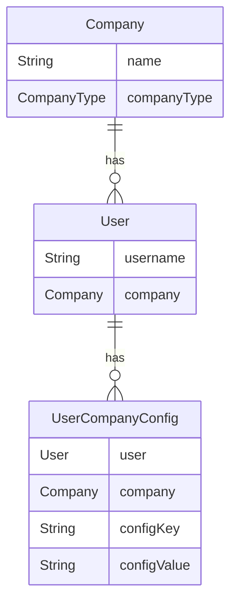

# Hello World!

## this helloworld test

### this is hellow world test2


For the source code below:

```java
public static void main(String[] args){

}
```


```mermaid
erDiagram 
      Company ||--o{ User : has 
      User ||--o{ UserCompanyConfig : has
      
      %% jmix-sill 中的用户实体 
      User{
          String username
          Company company
      }
      
      %% jmix-sill 中的 company 实体
      Company{
          String name
          CompanyType companyType
      }
      
      %% jmix-sill 中的用户配置实体
      UserCompanyConfig{
          User user
          Company company
          String configKey
          String configValue
      }
```
