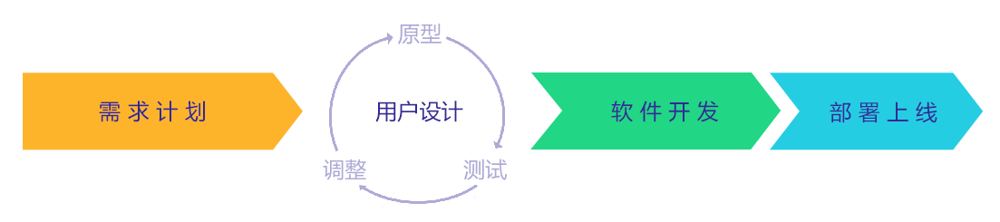
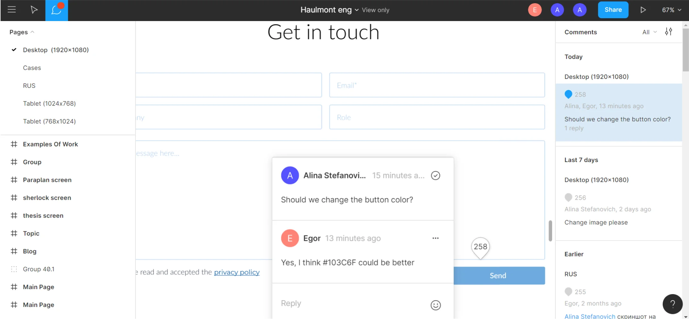
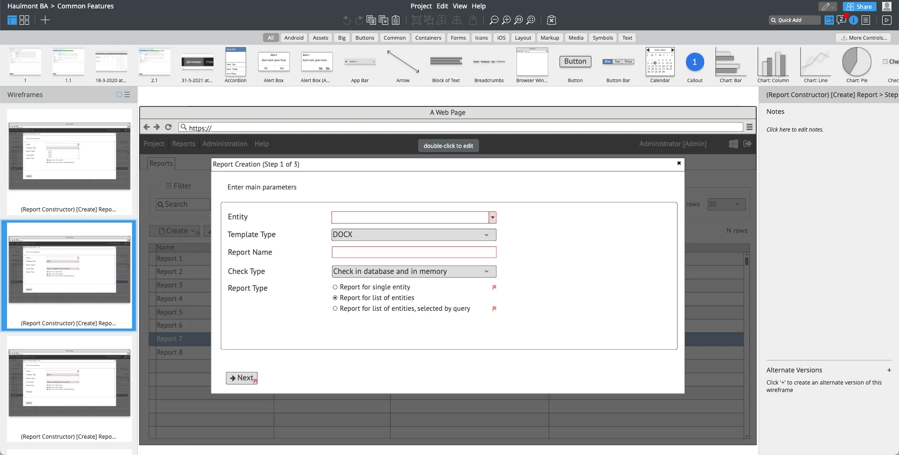
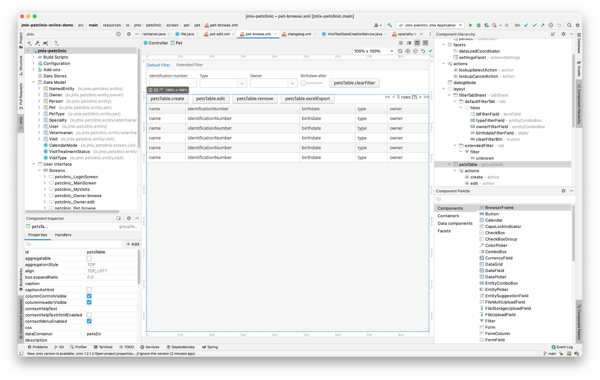

_什么是快速应用程序开发（RAD）？RAD 平台需要有哪些要素？_

<!-- more -->

 {.center .size-6 .radius .shadow}

<!-- # 快速应用程序开发 -->

## 什么是 RAD ？

快速应用程序开发（RAD）是一种专注于设计和原型设计阶段的开发方法，目的是获得用户的即时反馈。与先进行初始计划再进一步执行的传统开发模型不同，RAD 有着更多的灵活性。通过快速增量更新和即时用户反馈的不断迭代，使得最终能获得更好的产出结果。

詹姆斯·马丁（James Martin）于 1991 年定义了快速应用程序开发（RAD）的模型，提供了除瀑布式开发过程之外的另一种开发过程。经典的瀑布方式能完美地适应建筑领域和其他一些行业，这些行业中，需求范围一般很少变动，且变动的代价非常高。例如，如果开始建造一座桥梁，则不可能在完成一半时将其改建成一条渡轮。

相反，软件的开发过程却是比较灵活的。对同一业务需求的解决方案通常不止一个，且变换解决方案的成本较低。因此，基于瀑布式的详细设计和提前规划通常会输给快速试错的开发方式，还有，站在用户的角度，往往只有在看到具体的产品时，才能有思路并提供更好的反馈。

快速应用程序开发方法论的核心是从费时费力的计划工作转移到快速建立产品的原型上来。具体来说，RAD 模型将软件开发过程分为四个阶段：

 {.center .size-8 .shadow}

1. 需求计划

在此阶段，用户和项目团队一起确定目标系统未来要达到的目标。主要关注于需要实现的业务目标，对于需求的严谨性没有太多要求。在原型设计阶段快速调整业务目标及需求的能力是关键。

2. 用户设计

用户设计是快速应用程序开发方法的核心部分，是与瀑布模型相区别的关键点。这时，开发人员开始构建系统原型。目标是通过最快、成本最低的方式给用户提供一些可演示的内容。原型产品可以只满足一部分需求，或者只覆盖少数场景，并且，在代码编写时，也可以抄近路。

在原型准备好后，会拿给用户演示。开发团队尽可能收集所有的反馈，这里，原始需求会不可避免地发生改变：纸上似乎正确的东西在应用程序中可能完全不同。根据这些反馈，开发人员会重新修改原型，直到用户对结果感到满意。

3. 软件开发

现在我们已经确切地知道了需要完成的内容。开始进行实质性地开发并测试，以便按期交付产品。这个阶段不能再走捷径了，需要关注产品的质量、可伸缩性、可维护性等等。并且，用户会一直参与对产品进行反馈，直到开发的最后阶段。在快速应用程序开发的周期的这个阶段，仍然可以接收需求的一些小调整。

根据我们选择的开发工具和其他因素，我们在设计阶段开发的原型可能会直接废弃不用。

4. 部署上线

这是最后阶段，包括验收测试、产品上线和用户培训。

## 快速应用程序开发的优缺点

RAD 将天平从可预测性倾向至敏捷性，这样会带来一些正面和负面的影响。

### 优点

1. 高质量

有了用户在原型阶段的深度参与，最终的完成的系统能更加贴合他们的需求，用户的满意度相对较高。

2. 降低风险和成本

使用瀑布式开发方法，用户只能在项目交付时看到结果并提供反馈。在这一阶段如果再进行需求变更，将会费钱又费力。而使用 RAD 方法时，在原型阶段用户已经参与对成型的产品提供反馈，此时修改后面的需求开销不大。

### 缺点

1. 缺乏可扩展性
   
RAD 开发模型需要开发团队与最终用户之间的紧密合作。当团队太大或利益相关者太多时，原型制作过程不可避免地会变慢。如果每个人都参与，对变更需求的频繁讨论也变得非常困难。因此，RAD 被认为是中小型团队的最佳选择。

2. 软件设计不佳

在原型设计阶段偏重于特定的业务功能和走捷径的做法有时会导致整个解决方案设计不佳。

3. 前期难以控制

显然，在项目完成原型开发阶段之前，是无法对项目范围、预算和时间进行预测。不过，仍然可以基于需求计划阶段的结果来确定一个大概的预期。

4. 对用户依赖大

RAD 方法假设用户在项目生命周期的所有阶段都要参与，特别是需要深度了解需求的业务专家的参与，而他们通常是是公司中最忙的人。

## RAD vs. Agile

如果您知道敏捷开发，此时，您也许觉得，快速应用程序开发与敏捷开发似乎是一样的？

RAD 这个术语的出现比敏捷早 10 年，而且也同样使用了迭代的方法，所以通常被认为是敏捷开发的前身。但事实上，RAD 是一种具体的方法论，而敏捷则涉及到哲学立场，不仅仅指软件开发。所以公平一点说，RAD 与 Scrum、KanBan、TDD 等开发方法一样，都属于敏捷软件开发方法学的内容。

## 我的项目能用 RAD 吗？

如上所述，RAD 无法在严苛的环境中使用，例如：

- 需要预先知道预算和开发时间表
- 用户无法定期参与或者用户不想过多消耗时间和精力
- 项目范围大，参与团队多，利益相关者多

大型企业或政府组织的项目通常满足这些特点。但是，即使在这种情况下，也可以使用一些 RAD 的理念。例如，对于固定价格的项目，可以分割一部分预算用于原型和需求变更；如果有客户愿意参与，则将原型的范围限定在需求最难以确定的部分。

而另一方面，对于中小型企业或部门内的项目，则使用 RAD 会非常有效。在这些项目中，业务人员自己控制预算并且对项目成果非常用心。非常典型的例子就是各种业务线（LOB）应用系统，指的是业务流程自动化或者为了更有效地运行特定业务而开发的应用系统。

同样，对于创建网站这种项目来说，RAD 也非常适合。这种项目一般规模不大，涉及的相关人员也不多，但是需要他们尽早地参与，因为设计这个东西，是非常主观的，每个人的想法都不一样！

## 快速应用开发的工具

RAD 方法论的成功很大程度上依赖于快速地出原型以及紧密的协作，因此，选择合适的工具非常重要。

### 设计与原型制作

_例如：Figma、Balsamiq、Invision、Sketch、Adobe XD。_

使用诸如 Figma 和 InVision 之类的快速应用程序开发工具，图形设计师和用户体验专家能够快速完成原型，为用户提供完整的设计和可点击操作的原型来收集他们的反馈。一旦原型的某个迭代版本获得用户的认可，就可以将项目导出为前端开发人员可重用的格式，从而进入实质性的开发阶段。这些工具主要用于创建网站，但也可以为更复杂的应用系统或用户界面设计用户体验和原型。

 {.center .size-8 .shadow}

其他的一些工具，比如 Balsamiq，主要是业务分析师使用。通过简单的线框图设计业务原型，而漂亮的最终设计通常在后期完成。这类工具对于具有复杂用户交互功能的大型系统是不错的选择。

 {.center .size-8 .shadow}

### 软件开发

现阶段，软件开发仍然是创建应用系统中最耗时、最昂贵且最不确定的部分。因此，现代快速应用开发平台整合了坚实的基础体系框架、提供了实现典型功能的完备组件，当然，还有可以促进快速开发的工具。所有这些都是为了在项目的原型开发阶段和后续构建过程中更快地交付成果。

Gartner 和 Forrester 这样的咨询公司一直在引入新的术语来区分这些平台：低/零代码应用平台（LCAP）、高效率应用平台即服务（HPAPaaS）、多体验开发平台（MXDP）。但其实，这些可以按其目标受众进行分类。

### 低代码/零代码平台

_例如：Mendix、Outsystems。_

这些平台的核心理念是使没有开发技能的业务用户（指高级用户或业余开发人员）能够非常快速地交付可用的应用程序。当然，追求这种简单性的同时便意味着失去了灵活性，并且还有各种限制。我们在[上一篇](lcap-dangerous-bet.md)文章中介绍了这些限制和相关的风险。这种类型平台的产出要么是原型，要么是非常基础的系统。

 {.center .size-8 .shadow}

### 为专业开发人员服务的平台

这些平台主要通过提供更高级别的 API 和代码生成来提升软件开发的速度和乐趣，开发人员无需编写重复的样板代码和通用基础功能。

Embarcadero RAD Studio（即以前的 Borland Delphi）是该领域的先驱之一，以可视化的 UI 设计器而闻名。诞生在网络时代之前，目前仍然能用于桌面和移动应用开发。

其他快速开发平台则更加关注 Web 应用的开发，因为现在用户主要通过 Web 进行交互。例如，在 [Jmix](https://www.jmix.cn) 平台，我们尝试提供便利、快速的数据模型和界面的可视化设计，并结合了现代开源技术的强大功能。这种方式不仅可以提高原型制作速度，还可以将原型进行继续开发，成为可靠且可扩展的全功能企业应用系统。

 {.center .size-8}

如果您有兴趣深入研究 RAD 平台，我们还有一篇关于 RAD 发展的[文章](rad-twenty-years.md)供您阅读。

## 总结

快速应用程序开发是遵循敏捷哲学的开发方法之一。RAD 的关键原则是最终用户的紧密参与以及基于用户反馈的快速迭代原型设计。一旦用户对原型满意了，重点便转移到了交付最终成型的产品上。

在项目中快速制作原型和成功实施 RAD 方法的最重要因素就是选择正确的工具。针对不同类型的应用系统、项目阶段和团队技能，可选的工具和平台也相当多。

RAD 是一个古老的概念，但如今随着数字化转型的趋势以及快速推出产品的需求推动，它正在经历着复兴。对于适合的项目类型和团队配置，RAD 方法有助于在降低风险和缩短交付时间的同时提高用户满意度。

