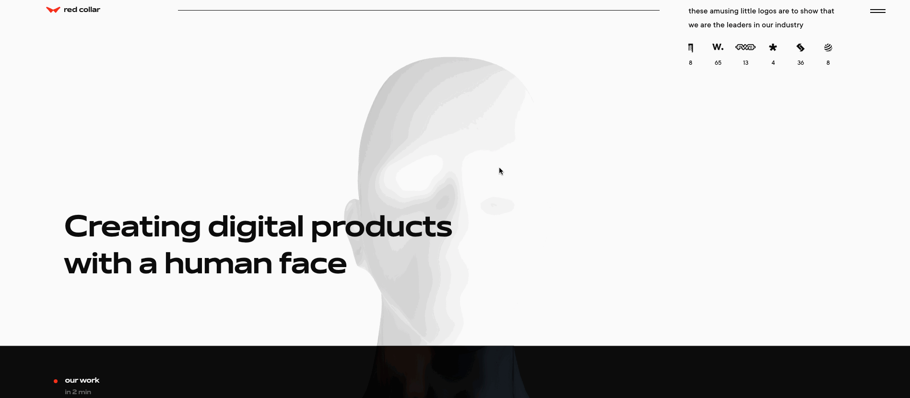
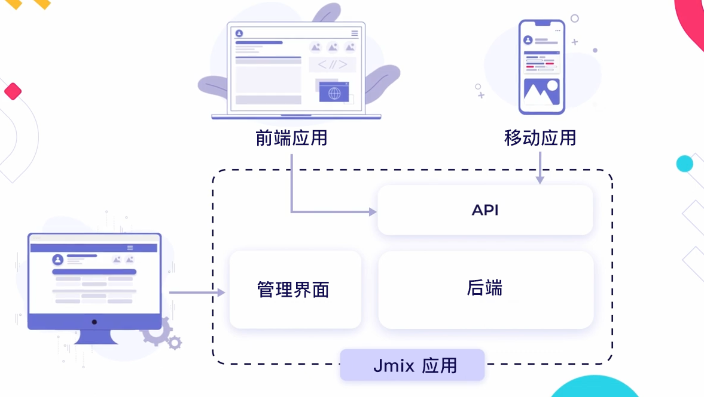
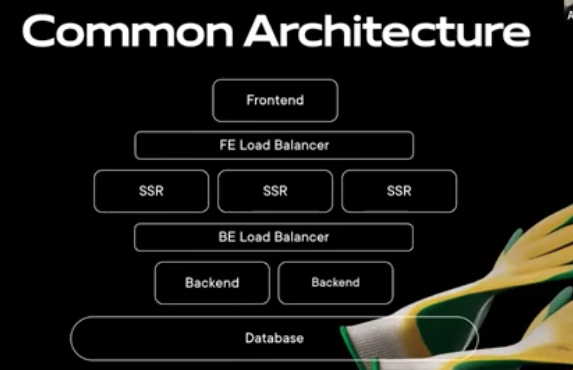

_使用Jmix Web快速开发框架，仅用21天构建功能完善的CMS系统_

<!-- more -->

 {.center .size-8 .radius .shadow}

<!-- # 大标题 -->

## 故事

嗨，大家好！Jmix Web快速开发框架在今后会给大家提供更多的内容，包括一些Jmix使用的高级场景和技巧。有这么一个场景：项目要求构建非常复杂的Web网页，比如包括非常炫酷的动效或者一些基于WebGL的3D内容展示，这些复杂的网页使用Vaadin非常难以实现。因此，这种项目中，我们首先考虑的是一些流行的JS框架，比如Vue、React等，在JS的领域，已经有非常成熟的动效和WebGL库可以使用。

针对这种场景，Jmix最近举行了一次网络研讨会，介绍了使用Jmix快速开发框架作为企业网站CMS（内容管理系统）后端的优势。案主是[Red Collar](https://redcollar.co/)，从他们的主页就可以看出，这家公司是以前端技术为主：

 {.center .radius .size-8 .shadow}

这一次，我们的案主遇到了一个难题，与我们上面的描述类似：一家工业手套生产商（[Bronitex](https://bronitex.ru/)），要求开发一个网站，可以管理一些内部流程，但同时还要给客户和合作伙伴展示一些产品动效和产品目录，并要求在2个月内交付。网站的功能点具体包含：

1. 手套目录，需要支持根据过滤条件筛选以及一些动画。
2. 企业招聘模块。
3. 客户和合作伙伴的沟通反馈模块。
4. CMS模块，要求能对网站进行自定义管理。
5. 非功能需求，网站要有很棒的可视化效果和动画。

其中第四点CMS非常重要，因为客户的要求是希望他们自己能管理网站的内容，不需要任何外部支持，因此，CMS必须对用户友好。

另外，交付时间也非常紧，2个月！

## 架构

作为后端应用时，系统架构如下，Jmix提供用于后台管理的界面，以及与前端通信的API。

 {.center .radius .size-8 .shadow}

使用Jmix作为CMS后端的几个优势：

1. 界面生成器可以仅通过几次鼠标点击生成实体的CRUD界面，天然符合CMS中关于内容管理的要求。
2. 基于Vaadin开发管理界面，开发者无需切换IDE，使用熟悉统一的技术开发后端界面。
3. 提供REST或GraphQL API，满足多样化前端的需求。
4. 包括报表和Dashboard组件，可以方便生成内容管理的概览和统计信息。

## 讲述

现在我们看看案主讲述的内容，下图为案主的系统架构：

 {.center .radius .size-6 .shadow}

我们看到这个系统的要求是非常高的，前端很复杂，还要有动效的WebGL。我们使用了React作为前端核心框架，开发了单页面应用。但是对于用户来说，他们是感觉不到这是单页面应用的。但是，这种方式有两个问题，一方面这种应用非常大，有3D模型和其他数据需要加载，网页启动需要很多时间；另一方面，这种网站对搜索引擎不友好。因此，我们加了SSR（服务端渲染）层，能做到预渲染，使得速度更快，而且对搜索引擎更加友好。此外，SSR节点可以扩展，并直接运行在CDN，比如AWS的边缘主机，这样访问速度得到了进一步的提高。

系统的后端也需要按照这种架构进行调整，我们也加了后端负载均衡。后端系统主要是如何存储、管理数据，以及为前端提供什么样的数据。理想状态下，我们不希望再编写很多样板代码，因为在前端开发中我们已经花了不少成本。我们需要减少开发量，使用一些能直接用的管理界面，还需要支持用户管理，提供REST API。

这些就是我喜欢Jmix的原因。我们用过一些其他的技术，以及一些Headless CMS系统（不为前端提供样式，仅管理数据的CMS），这些CMS通常用来管理网站，提供文章、文本、blog等数据源。但是无法实现自定义的数据库，而这一点是我们特别需要的。Jmix可以自己定义数据源和管理界面，并支持REST API。

Jmix提供了管理页面，我们甚至连颜色都没有修改。因为客户觉得色彩搭配得很不错。

 {.center .radius .size-8 .shadow}

我们喜欢使用Jmix开发，与直接用Spring开发相比，Jmix仍然是非常省事的。创建表、实体以及配置实体关系总共不需要10分钟，完全不需要手动创建数据库脚本、类、对象查询语句等等。{ .enhanced }

作者注：案主在决定使用Jmix之前，已经花了几个月的时间调研试用Jmix了。通过这段时间的试用，他们才能在后面的项目中“火力全开”地使用Jmix进行高效的开发。

## 结果

项目很顺利地在预订时间内完成交付。下面是案主使用Jmix拿到的小结果：

- 与使用Laravel（PHP框架）相比提升了2倍的开发速度，仅3周时间完成CMS开发。
- 节省了约1/3的资源
- 积累了经验，后续又基于Jmix开发了四套后端应用。

最后，是开发出来的网页效果，感兴趣的伙伴也可以访问Bronitex的主页查看，不得不说，确实够炫：

 {.center .radius .size-8 .shadow}
