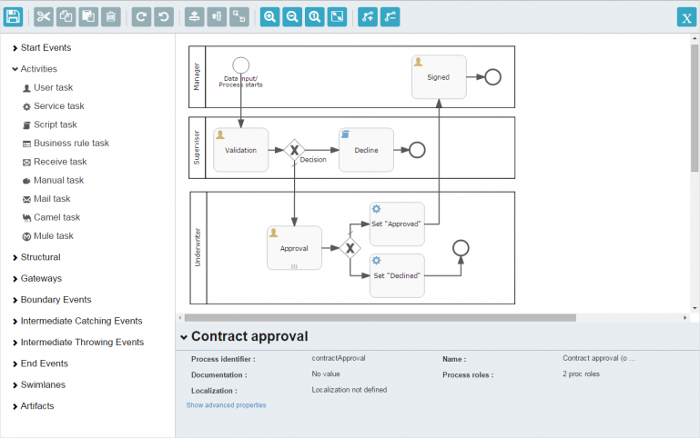
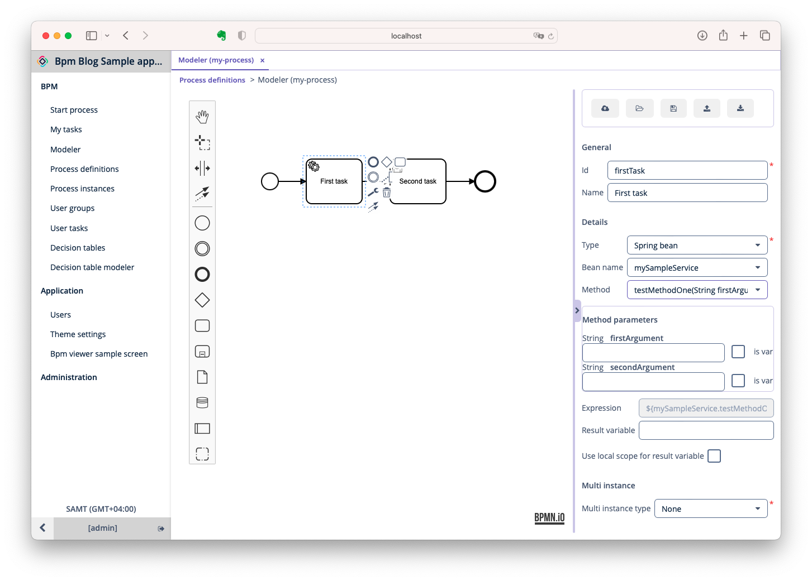
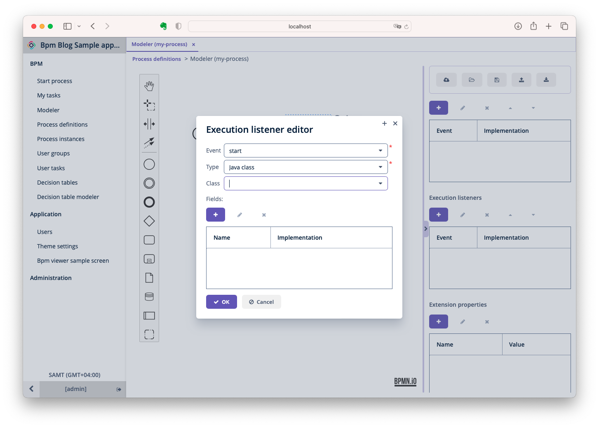

_摘要_

<!-- more -->

 {.center .size-8 .radius .shadow}

<!-- # 大标题 -->

[Jmix](https://www.jmix.cn) 是一个用于构建企业级应用程序的开源高生产力平台。全球的Java开发者使用Jmix构建以数据为中心、以业务流程为中心的系统以及内容管理系统（CMS）等，特别是在有严格的时间和预算限制时。Jmix的优点简而言之，能使Java开发者成为全栈开发者，并最终能交付标准的Spring Boot应用，无运行时费用。在开发方面，Jmix提供对开发者友好的专业IDE，而且后端和UI使用单一Java/Kotlin语言，基于Spring Boot主流核心技术，这是吸引开发者的主要原因。这篇文章探讨了我们如何在平台内引入工作流，嵌入 [bpmn-js](https://github.com/bpmn-io/bpmn-js) ，以及用户如何从中受益。

## 初识 BPMN

以数据为中心的CMS系统通常需要业务流程自动化的功能，以便实现事务性的业务逻辑与代码分离。这可以通过集成工作流建模器来完成，支持分析师和开发者按照BPMN标准设计业务逻辑。我们从2017年才开始实现该功能，因为那时有收到来自社区的需求。最初，在Jmix的前身CUBA平台中，我们提供了由Activiti提供支持的自定义业务流程设计工具。

 {.center .size-8 .radius .shadow}

我们在业务流管理组件中提供了这个建模器，包括以下功能：

- 提供运行时BPMN可视化设计器；
- 集成数据模型，将Activiti数据模型包含在CUBA实体中，使开发者能非常方便地在在UI和业务逻辑中使用；
- 流程表单，用于分配和操作流程；
- 用于管理流程模型、运行流程实例和分配流程的UI界面；
- 子流程，现有的流程模型可以合并到更大的流程模型中；

BPMN建模器会在内部以特定的JSON格式保存业务流程。当开发者启动流程部署时，CUBA会自动将业务流程转换为Activiti BPM引擎支持的XML格式。这一步虽然有些粗糙，但是也标志着集成可视化BPMN设计器的初步成功。后续我们还提供了与工作流配合使用的其他元素，例如数据模型、特定的业务表单等。尽管CUBA社区已经有开发者在真正的项目中使用这个功能，但平台团队发现CUBA提供的扩展组件有潜在的扩展性问题。到2018年底，BPMN建模器的UI也已经明显过时。

## 在 Jmix 中重新构建 BPM

2019年，我们开始设计下一代CUBA平台 - Jmix。设计新版平台时，主要有两个原则：

- 尽可能减少我们自己实现的技术，更多的是与主流Java应用程序开发方法对齐；
- 将高生产力工具整合到统一的开发环境中，无需在不同的窗口之间切换，并将开发者所需的一切放到鼠标轻易能点到的地方。

我们非常看重“不重新发明轮子”的原则。因此，怎样能以最少的改动整合现代BPMN建模器变得非常重要。经过研发团队的努力和调研，我们认为bpmn-js的功能符合我们的要求：

- 现代的外观样式；
- 非常强的定制化支持，例如新元素和样式；
- GitHub 上丰富的实际案例；
- 给力的免费社区论坛支持；
- 快读迭代。

引擎方面，我们也从Activiti切换到Flowable BPM。

建模器方面，我们将bpmn-js作为运行时建模器集成在Jmix应用程序中。新的BPMN建模器非常漂亮：

 {.center .size-8 .radius .shadow}

## Java开发者可以使用的bpmn-js

如前所述，Jmix的重要功能之一是开发者仅使用一种语言来构建应用的前后端。该功能的关键技术支撑由Jmix框架内的Vaadin提供，Vaadin支持用Java API操控前端布局。因此，我们决定将bpmn-js建模器包装成Vaadin UI组件，提供特定的Java方法包装js-modeler函数。结果是开发者拿到的是一个现成的Java组件，该组件可以根据业务任务要求无缝集成到应用程序中。

作为此实现的一个示例，您可以检查用于监控进程当前状态的Java组件。开箱即用，Jmix在应用程序运行时提供了一个BPM子系统，并允许在进程实例编辑器屏幕中监控进程状态，如以下屏幕截图所示。

 {.center .size-8 .radius .shadow}

在Jmix中，开发者可以轻松重用 `bpmnViewer` 组件，只需几个简单的步骤即可按需将其添加到自定义屏幕中。首先，您应该将 `bpmnViewer` 组件作为标准UI组件添加到Jmix屏幕布局描述符中。

 {.center .size-8 .radius .shadow}

其次，必须将bpmnViewer注入自定义屏幕控制器，并应根据应用程序的业务逻辑指定行为。

 {.center .size-8 .radius .shadow}

如上图所示，Java开发者手中拥有在应用程序中嵌入和配置BPMN渲染的所有工具：

1. 注入bpmnViewer组件
2. 将BPMN XML设置到查看器组件中
3. 调用addMarker函数来设置元素上的特定样式

完成后，它会在您的自定义屏幕上无缝运行。用最少的编码工作，Jmix开发者可以在整个项目中重复使用bpmn-js功能。

 {.center .size-8 .radius .shadow}

这是一个例子，说明了bmpn-js与Vaadin技术的集成如何为应用程序开发过程带来新的想法。然而，我们不仅包装了bpmn-js建模器的现有功能，我们还用一些特定于Jmix的功能扩展了它。仅举几例：

- 服务任务配置工具窗口提供了一组字段，可以设置项目的Spring Bean，从而消除潜在的命名错误和错别字；
- 开发者可以使用方便的列表视图和编辑器对话框来管理执行监听器。

 {.center .size-8 .radius .shadow}

 {.center .size-8 .radius .shadow}

bpmn-js建模器和可嵌入的BPMN引擎的集成使开发者和分析师能够直观地设计业务流程，并将其与数据模型、应用程序角色和业务逻辑无缝连接起来。这看起来很现代，很有价值，但它与核心产品理念不匹配——开发者在创建业务流程时仍然需要在设计时间和运行时之间切换。我们的目标是引入一种体验，即开发者可以完成与运行时几乎相同的操作，但无需在不同工具之间切换。听起来很棒？实际上，它看起来甚至更好。

## 迁移到集成的BPM开发环境

2021年，当我们将由bpmn-js驱动的BPMN编辑引入IntelliJ IDEA IDE时，这种看似空的集成BPM开发环境的愿景成为现实。

 {.center .size-8 .radius .shadow}

我们保持了相同的应用程序开发生命周期——一旦在Jmix Studio中设计了一个进程，开发者就会在本地环境中使用嵌入式BPMN引擎在应用程序中运行它。最具挑战性的方面是在运行时将现有用户体验从之前设计的BPMN建模器转移到IntelliJ IDEA。我们的重点是为Jmix社区保持类似的体验，同时确保它原生于IDE工具设计指南。嵌入BPMN建模器画布并不特别困难；相比之下，创建IDE本机进程参数属性编辑器工具窗口被证明更具挑战性。经过一些内部研发后，团队决定在IDE工具窗口中对已编辑的属性项进行特殊高亮显示，将属性的逻辑分组保留在运行时。您可以通过比较Jmix运行时建模器和Jmix Studio建模器中的同一用户任务工具窗口来查看相似之处。

## 对开发者生产力的积极影响

总结一下我们从BPMN集成到Jmix中看到的一些好处：

- 使用bpmn-js，我们能够毫无顾忌地将BPMN编辑集成到IntelliJ IDEA中。作为开发者，您将获得出色的BPMN建模体验；同时，您将受益于统一的配置UX和代码智能功能。
- 您可以将分析师准备的BPMN图表直接上传到IntelliJ IDEA中，然后使用特定于项目的业务逻辑、用户屏幕、集成和异常处理来丰富它们，而无需切换到另一个工具；
- 您可以在开发者的工作站上部署和运行它，并测试其业务逻辑，以确保其按预期运行。在这里，您可以访问IntelliJ所有强大的调试工具，以简化流程并使其更高效；
- 完成本地调试后，您可以提交并将更改推送到共享存储库中，允许分析师查看BPMN图的更新版本，并在测试环境中运行的应用程序中检查图表的实时版本；
- 如果分析师需要更改BPMN模型，可以使用相同的工具在应用程序运行时调整图表，然后再次测试。成功测试后，可以下载更新的图表版本并发回给开发者以实施更改。
- 因此，使用Jmix，团队可以在已知工具中覆盖整个业务流程开发生命周期，更重要的是，它可以集成到CI/CD管道中。在实际项目中，开发者添加仪表板以实施各种流程分析并获取统计数据。这种方法与BPMS解决方案非常相似，该解决方案是根据Java或Kotlin中以数据为中心的应用程序和业务逻辑量身定制的。

多亏了bpmn.io项目，开发者可以在独立设计器中使用同样易于使用且广泛适用的工具解决各种用例，作为其IntelliJ IDEA的一部分或嵌入到应用程序中。