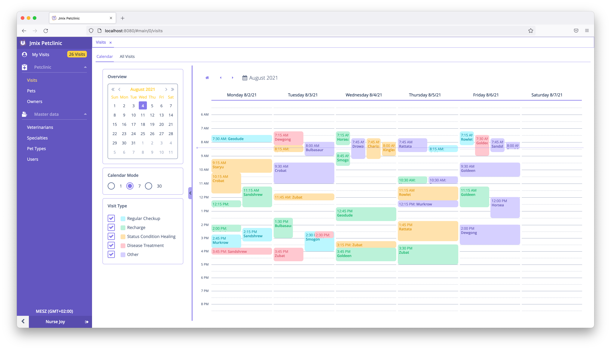
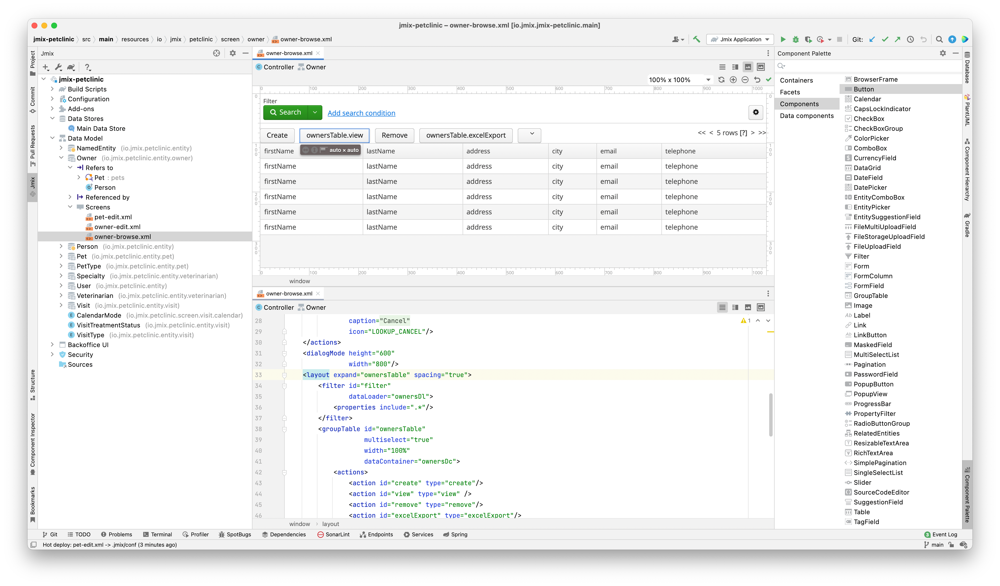
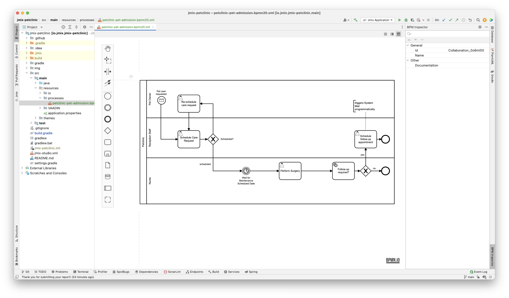

# [Jmix](https://www.jmix.cn) - 业务系统高效开发的新方式

世开 Coding2022-08-11

企业在数字化转型的过程中，都面临将现有的业务流程进行“软件化”的过程。然而，在我们的印象中，通常会觉得针对业务系统的软件开发不是特别高效。这背后有很多原因，从开发角度看，有一个主要的原因是软件开发者缺乏合适的工具。

目前市面上有不少非常流行的框架或者库，比如 Spring Boot (Java)，Express JS (Node)，React/Angular (JS)，但是这些框架只专注于解决技术问题，而并非为特定的业务领域定制，比如企业需要的电子商务网站、业务线系统或者企业资源管理系统。虽然从表面上看，这些框架“关注”所有类型的系统开发，但实际上，并不关注任何一种业务相关的特定领域。

因此，如果开发者能找到解决特定问题领域的开发工具，那肯定能提升该领域的开发效率。这种类型的开发工具确实存在，本文将介绍一个用于开发业务系统的工具 - Jmix。

Jmix 是一个全栈开发框架，可以帮您解决在编写业务系统时可能遇到的很多问题。

乍一看，您可能觉得这是一种低代码平台。但实际上，Jmix 框架具有更高的灵活度，并且能提供低代码平台无法达到的自由度：您可以**完全掌控**使用 Jmix 开发的每一个应用系统。使用 Jmix 开发的应用系统无需按照终端用户的数量进行付费，也没有供应商锁定问题。Jmix 将源代码放在第一位，是真正的、开源的“少代码”业务系统开发框架。来自开发者，服务于开发者。

如果您感兴趣，下面我们会介绍一些细节。

## 高效的系统开发
如上所述，Jmix 是一个专注于业务系统开发的框架，而业务系统通常有着相似的特性：

* 细粒度的安全功能
* 数据探索功能，包括报表、数据过滤等。
* 大数据模型
* 用于管理任务或主数据的大量用户界面

为了解决这些问题，首先，运行时的框架需要有良好的技术基础。其次，开发时需要有上下文感知的工具。即便满足了这两点，针对开发中很多常见的问题，开发者还是需要自己想解决方案。因此，框架还需要有第三个特性：具有一些开箱即用的功能，帮开发者解决业务系统中常见的典型问题。

有了这三个特性作为支柱，对于给定的问题域，我们就可以构建基本的有效软件开发环境了：

1. 集成全栈框架
2. 自带编程工具支持
3. 现有的开箱即用功能

下面我们介绍下 Jmix 是如何在这三个方面提供支撑的。

## Jmix 介绍

Jmix 是一个全新的框架，但仍然具有超过十年积淀的成熟度。Jmix 是 CUBA 平台的意识形态继承者，采用最新技术进行构建。CUBA 平台已被全球数千名开发人员使用，无论是小型初创企业或是财富 500 强企业。与 CUBA 平台一样，Jmix 的目标也是提升创建业务应用系统的效率，为高效软件开发的三个支柱提供解决方案。

Jmix 涵盖了应用系统的各个方面，从底层数据库设计至用户界面设计或 API 设计。它使用行业标准的框架和工具为开发人员提供最佳的体验。框架通过 Jmix Studio（IntelliJ IDEA 的插件）提供支持，帮助开发者摆脱多种工具协调的问题并加快开发进程。

专注于业务系统的开发使得 Jmix 提供的解决方案能在这一领域完美契合开发者的需求。如上面提到的业务系统软件开发支柱之一是要求有开箱即用的功能，Jmix 通过组件市场提供全栈组件（从数据库至用户界面）来满足这一要求，比如：

* 报表
* 全文搜索
* 业务流程管理
* 企业级安全子系统

这些组件无需太多集成工作便能直接使用。

Jmix 框架依赖很多开源软件，而且它本身也是开源的。其开源许可是 Apache 2.0，也就是说不会被强制使用某些公司特定的专有技术。

## Jmix Studio  

Jmix Studio 是一款 IntelliJ IDEA 的插件，通过与 IDEA 的无缝集成，Jmix Studio 能充分利用其优势，比如调试、测试以及开发者日常工作中需要的各种源代码辅助编程。Studio 提供了很多提升工作效率的方便功能。基于可视化数据模型设计器，Studio 能自动生成初始化的用户界面，开发者可以在这个基础上进行后续的修改。

开发者可以在源代码或可视化设计器之间随时切换，两边做的改动都会自动同步。这个功能支持所有的可视化设计内容：数据模型、用户界面、业务流、安全角色定义。

Jmix Studio 的主要功能都涵盖在免费版中。而一些能提高初级开发人员效率的功能，比如可视化设计器，则仅在两款商业版中提供。

## Jmix 架构

对于应用程序所需的各种功能，Jmix 都依赖于擅长这些领域的通用框架和规范：

* Spring Boot – Jmix 基于Spring Boot，用于依赖注入和业务逻辑编写
* JPA – 用于数据模型
* Liquibase – 用于数据库结构定义
* Vaadin – 用于用户界面
* Gradle – 用于系统构建

我们来深入了解下这些底层技术，以及它们在 Jmix 架构中扮演的角色。

Spring Boot 是 Jmix 架构的基础，因此开发者基于对 Spring Boot 的了解，很容易理解 Jmix 核心框架。

JPA 是一种广泛使用的 Java 规范，用来从关系型数据库访问数据。Jmix 在 JPA 之上提供了数据访问的 API，还结合了其他方面的功能，比如数据安全机制和软删除。

在数据库架构的更新和演进方面，Jmix 引入了 Liquibase。Jmix Studio 会根据实体模型的改动生成 Liquibase 的更改脚本。当然，开发者可以根据需要修改这些脚本。数据库方面，Jmix 支持所有的主流关系型数据库系统，比如 PostgreSQL, MySQL/MariaDB 等免费数据库，还有 Oracle，SQL Server 等商业版权数据库。

Jmix 默认使用 Vaadin 作为用户界面的框架。Vaadin 是一个面向业务应用程序的 UI 框架，有一些专门针对业务需求的 UI 组件。Vaadin 是采用后端架构的技术，不需要开发者编写 UI 和后端通信的 API。这样能减少一部分样板代码。它将前后端绑定得更加紧密，提供了额外的好处，比如将验证逻辑集中在一处，或者进行 UI 和后端的无缝调试。

在 Vaadin 框架中，使用 Java 代码定义布局和逻辑。这样开发者可以用一种语言编写应用系统中的所有代码，这样效率通常会更高而且更简洁。

Jmix 通过声明式布局定义、附加 UI 组件、界面抽象和 API 丰富了 Vaadin 的机制。

还可以使用基于客户端的 UI 框架（如 React/Angular/Vue）创建完全自定义的 UI。

安全是 Jmix 的核心功能之一。很多商业软件都对安全性有非常高的要求。Jmix 带有成熟的安全机制，可以精准地定义用户与数据之间的交互关系，这通过基于角色的访问控制功能实现。然而更进一步，Jmix 还提供了数据库行级的访问控制，例如“用户张三只能看到级别是四级以下的客户”或“允许用户张三更改客户的地址，但不能查看用户的信用卡信息”，这样的需求，在 Jmix 可以通过配置很容易完成。这些配置都是声明式的定义，可以在开发阶段完成，也可以在运行时由管理员配置。

数据访问规则贯穿整个系统。Jmix UI组件遵循每个用户当前设置的安全规则展示可访问的数据。同样的，在通过 API 或者编程的方式访问数据也会遵循用户的安全规则。这样的话，无论从哪里访问数据，都能保证使用一样的安全策略。但是 Jmix 也不会在数据安全方面限制太严格，如果不需要通用的安全机制，也有办法可以关闭。

Jmix 默认是开启安全机制的状态，从而在开发者编写代码时，不需要在写每行代码时考虑安全问题，只需要遵循 Jmix 的安全设计理念即可。

从我们已经了解的功能来看，Jmix 已经提供了不少内容。实际上还有一点我们没有说，那就是开箱即用的功能。Jmix 并没有在框架中涵盖所有的功能，而是允许通过创建和使用扩展组件以模块化的方式增强框架的能力。

## Jmix 扩展组件
Jmix 附带各种扩展组件，可以为业务系统中常见的问题提供解决方案。扩展组件是一个无缝集成的完整解决方案，包含从数据库至用户界面的所有内容。这也是 Jmix 扩展组件与业务系统中集成的其他库的主要不同点。

### BPM（业务流管理）
业务应用系统很常见的一个需求就是对业务中的某种流程进行建模。BPMN 是这类问题解决方案的标准。Jmix 的 BPM 是一个扩展组件，通过使用 BPMN 工作流引擎对 Jmix 应用系统进行增强，该引擎基于 Java 生态中最常用的框架 Flowable 构建。BPM 组件将 Flowable 无缝地集成进 Jmix 业务系统，并提供一系列附加功能，如流程设计器，流程管理员界面，以及简化的 API。有了这些能力，在业务流中多人协作的流程就很容易建模了。

### 报表
报表组件解决了使用业务系统中数据创建报表的问题。报表类型支持多种格式，如 DOCX、XLSX、PDF、HTML 等。该组件将报表引擎集成进 Jmix 应用系统，并增加了易用功能，比如报表界面创建向导、数据提取接口等。

### 搜索
以数据为中心的业务系统的一个重要功能是能高效地浏览数据。Jmix 提供了两个解决方案。

首先，核心框架中，有一个功能强大的过滤器 UI 组件，用户可以通过数据的字段（或关联数据的字段）对数据进行过滤和筛选。

其次，在非结构化数据搜索方面，Jmix 提供了一个基于 Elasticsearch 的组件，用户可以像使用搜索引擎一样在业务系统中用关键字搜索业务数据。通过该组件可以配置 Elasticsearch 索引，组件也会自动将修改的数据从数据库发送至搜索引擎，并提供 UI 组件可以通过用户界面进行搜索。另外，该组件也无缝集成了数据安全功能，用户只能看到他们被授权看到的数据。

### 电子邮件
Jmix 有多个组件可以在业务系统中集成电子邮件功能。通过界面操作或者开发者编程的实现方式，邮件可以直接从业务系统中发送。同样，也可以在业务系统中通过 IMAP 协议接收邮件，并根据邮件的属性触发其它业务系统操作。

另外，电子邮件可以与 BPM 组件集成，实现业务流程邮件通知功能。

### LDAP / SAML 用户认证
很多业务系统都需要与集中式的用户管理中心做集成。Jmix 通过扩展组件的方式支持集成 LDAP 和 SAML 单点登录。如果使用了这些组件，Jmix 内部的用户管理将自动适配外部的用户管理系统。

### API 
对于现代业务系统来说，与外部系统的集成是非常重要的。有了 Spring Boot 作为基础，可以实现通过各种协议为外部系统提供完整的自定义 API。另外，Jmix 还提供两个扩展组件自动对外提供数据和功能接口：REST API 和 GraphQL，这两个组件也都默认支持数据访问的安全机制。

上面提到的这些是最常用的组件。Jmix 核心团队和社区还提供其它各种各样的组件，每个组件都能解决一个特定的问题，比如审计日志，多语言支持，计划任务，动态属性等。Jmix Studio 中能访问组件市场，通过几次简单的点击就能轻松探索和安装扩展组件。

## 结束语
Jmix 是一个创建业务线系统的专业工具。通过关注特定的问题域，它能减少解决问题所需要的时间并提高开发效率。

Jmix 涵盖了高效软件开发的要素：集成了 Java 生态中的全栈框架，提供了开发者工具，以及解决常见问题的扩展组件。

基于模块化和开放的架构，框架非常灵活。能以各种方式扩展和修改核心功能。Jmix 有持续增长的社区，并且在核心框架和扩展组件方面保持着积极的开发。

高效的软件开发能加快问题反馈和响应速度，这样能与用户进行更多的沟通，以提供更好的解决方案。这种良性循环不正是我们在每天的开发工作中所期盼的吗？

如果您觉得 Jmix 看上去不错并且有兴趣试试，可以从我们的[《快速入门》](https://www.jmix.cn/learn/quickstart/)向导开始。如果您有任何关于 Jmix 的问题，欢迎访问我们的[开放社区](https://forum.jmix.cn/)。

