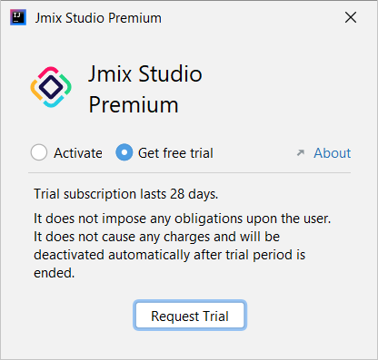

_这里我们整理了关于 Jmix 适用场景、许可、支付、培训等大家常常咨询的问题的答案。_

# Jmix Q&A

<!-- # Jmix FAQ -->

## 常见问题

### Jmix 适合什么项目和开发者？ :id=suitable

Jmix 的使命是简化开发业务线 Web 应用系统，并提供卓越的生产力。这些业务系统是在公司、区域或部门级别运行。此类型的系统范围很广，从电子表格到高度专业化的自定义系统，分为 ERP、CRM、EAM、SCM、WMS、ECM、ERM、HRM 等。这类系统的典型特征是：

- 具有重要的业务逻辑或需要流程自动化
- 有大量的数据模型
- 统一且功能化的 UI，且 UI 界面数量较多
- 用户数量可预测，一般是公司内部职员或合作伙伴

Jmix 是为专业开发者打造的产品，来源于开发者，服务于开发者。仍在使用旧技术栈的软件工程师或者只有 Java 基础知识的新手都可以使用Jmix，并且也能非常高效！Jmix 定义了应用程序的架构，并能指导您轻松地部署应用程序。因此，适合下列类型的团队：

- 使用单一 Java/Kotlin 语言
- 初学者多的团队（通过 Jmix Studio 辅助编程）
- 使用旧技术栈，期望转型的团队，例如，FoxPro、Oracle Forms、MS Access、Lightswitch、Silverlight、Delphi

另外，Jmix 也适合下列类型的项目：

- 作为面向大量用户系统的具有高级别管理界面的强大后端
- 对老旧系统进行现代化改造（Jmix 支持数据库反向工程）
- 内部流程和工作流自动化（Jmix 有 BPM 引擎）
- 避免 Saas/低代码 供应商费用和限制

### Jmix 开发的项目安全性如何？ :id=safety

一些怀疑论者声称开源软件不如专有软件安全。但这只是一个理论假设。开源代码的关键差异化优势在于，会有远远超出一个小团队数量的眼睛盯着代码改动。由于对代码有完全的访问权，因此可以做深度的代码检查从而防止应用程序的突然崩溃，开源的代码没有“黑匣子”。

从 2016 年开始，CUBA 平台作为开源项目进行开发。平台团队持续发布公开透明的产品路线图，并且通过公共的 GitHub 仓库定期管理问题跟踪。Jmix 平台继承自 CUBA 平台，代表了一个基于面向未来的技术栈的成熟开源项目。

平台的成熟度不能保证排除了所有的安全风险，所以仍然需要强制的安全保障程序。但拥有超过 25,000 名成员和 1000 多个使用该平台完成的项目的强大社区为构建安全应用程序奠定了坚实的基础。

### Jmix 提供哪些支持？ :id=support

我们为使用 Jmix 的开发者和企业提供免费和收费的服务，其中**免费服务**包括：

- [视频](https://www.jmix.cn/learn/video/)和[文档](https://docs.jmix.cn/jmix/intro.html)
- [程序示例](https://www.jmix.cn/learn/live-demo/)，其中[在线示例](https://demo.jmix.io/sampler)网站提供了源码，可以直接复制到项目中。
- [社区论坛](https://forum.jmix.cn/)，这里是我们的知识积累宝库，可以搜索你要问的技术问题，或者提出新的问题，我们会有工作人员免费解答。

**收费服务**包括[培训](#training)和技术外包、技术咨询服务。其中，技术外包按工作量估算，技术咨询按小时预付费购买，服务提供内容主要如下：

- 项目技术开发外包
- 为您的项目实现自定义的平台功能
- 帮助您做架构设计
- 平台功能使用的一般咨询
- 代码审查

如需使用收费服务请发邮件至 <a href="mailto:admin@abmcode.com?subject=Jmix服务咨询">admin@abmcode.com</a> 我们会尽快回复并联系您，期待您的来信！

<!-- ## 案例 -->

## 商业订阅 :id=license

### Jmix 许可怎么收费？

Jmix 平台由开源框架、Studio 和扩展组件市场三部分组成。其中开源框架使用的 [Apache 2.0 许可](https://www.apache.org/licenses/LICENSE-2.0)，完全免费并且可以自由分发。当您使用 Jmix 收费订阅计划时，您只是为**开发者席位付费**。我们只针对**可视化开发工具、模板和扩展组件**收费，这些功能提升开发团队的生产力，使数字产品的交付更加快捷。我们提供基于开发者数量的订阅定价模型，而不是基于用户的定价（运行时定价）和基于使用的定价（与业务价值相关）模型。**保证您可以不受限制的自由使用和交付您的 Jmix 应用程序**。

### Jmix 许可价格？

Jmix 许可价格请参考我们的[订阅计划和价格](https://www.jmix.cn/subscription-plans-and-prices/)网页。

### Jmix 许可如何购买？ :id=payment

支付方式支持通过[在线商店](https://www.jmix.io/store/#/store/)直接支付。如果遇到银行网关问题支付不成功，或者希望通过对公支付，可以选择发邮件至 <a href="mailto:admin@abmcode.com?subject=Jmix许可购买">admin@abmcode.com</a> 我们会尽快回复并联系您，期待您的来信！

!> 线上支付仅由 Haulmont 公司提供形式发票（Invoice），也可用于财务报销，支付后会由系统自动发送许可秘钥。
 国内线下支付，可以提供小微企业增值税普通发票或 3% 税率增值税专用发票。根据付款时间当天或 1 个工作日内发送许可秘钥。

### 购买是否有优惠？ :id=discount

我们为 Jmix **企业开发版订阅**提供批量优惠：

classPlugin:{"target":"class","value":"table-wrapper","idx":0,"class":"abmTable fifty"}
| 开发者数量 | 优惠折扣 |
| ---------- | -------- |
| 5 个以上   | 九折     |
| 10 个以上  | 八五折   |
| 20 个以上  | 八折     |
| 30 个以上  | 七五折   |

**线下支付还有供应商优惠**，欢迎给我们[发邮件](mailto:admin@abmcode.com?subject=Jmix许可购买)咨询，期待您的来信！

### 各个付费版之间有什么差别？

版本之间的差别请查看我们[订阅计划](https://www.jmix.cn/subscription-plans-and-prices/)网页中的**订阅计划功能对比**部分，需要注意的是，**BPM 流程引擎仅包含在企业开发版**中。

另外，Jmix Studio 为新用户提供了 28 天的试用期，可以在 IDEA 中安装了 Jmix 插件之后点击**Request Trial**，查看是否能申请试用：

## 培训 :id=training

### 公司培训 :id=companyTraining

我们为公司提供**线上培训**（腾讯会议），培训内容包括框架使用基本培训、背景知识培训、如何提高开发效率以及定制需求的培训。培训内容可根据特定的项目内容，特定的领域做定制化。培训具体费用根据人数、培训内容、培训时长有不同定价。请参考下面的培训目录：

<a class="download-button" href="https://cdn.abmcode.com/zh-cn/jmix/_media/jmix-qa/Jmix_training_catalog.pdf" target="_blank" download>下载课程目录</a>

如需咨询培训，请发邮件至 <a href="mailto:admin@abmcode.com?subject=Jmix培训咨询">admin@abmcode.com</a> 并提供下列内容：

1. 参加培训人数
2. 团队基础（前端，Java，Spring，数据库，编码年限等）
3. 根据目录裁剪的培训内容
4. 可选：
   - 项目概况，以便我们能针对性的准备 demo
   - 其他有关培训的要求

收到您的邮件后，我们会尽快回复，期待您的来信！

### 个人培训 :id=selfTraining

在学习和使用方面，Jmix 提供了完善的文档和培训视频，建议按照下列内容完成个人培训：

前提条件：
1. 需要有基础的 Java/Kotlin 知识，了解面向对象的设计和编程。
2. 需要有基础的 Spring/Spring Boot 知识，了解 Spring 容器，Spring bean，Spring Boot Configuration 等。

培训内容：
1. 入门：
   1. 根据[安装说明](https://www.jmix.cn/jmix-plugin-installation/)在 IntelliJ IDEA 中安装 Jmix Studio。
   2. 根据[Jmix 快速入门](https://www.jmix.cn/learn/quickstart/)花 15~30 分钟完成一个小而全的项目，其中包含：
      - 数据模型设计和数据读写。
      - 创建用户界面和业务逻辑。
      - 增加安全机制。
   3. 查看 [Jmix 在线示例](https://demo.jmix.io/sampler/)，并尝试从示例中复制代码至学习项目中，在自己的项目中运行并展示复制的示例。
2. 进阶：
   1. 进一步了解 [Jmix Studio](https://docs.jmix.cn/jmix/studio/studio-ui.html) 的全部功能。
   2. 学习 Jmix 的[安全机制](https://docs.jmix.cn/jmix/security/index.html)。
   3. 了解 Jmix 开箱即用的[扩展组件](https://docs.jmix.cn/jmix/add-ons.html)，包括 BPM。
   4. 了解 Jmix [架构](https://docs.jmix.cn/jmix/intro.html#architecture)，[模块和扩展](https://docs.jmix.cn/jmix/modularity/index.html)，并学习[开发 Jmix 扩展组件](https://blog.abmcode.com/#/zh-cn/jmix/jmix-new-dev-way)。
   5. 了解 Jmix 的[主题和自定义主题](https://docs.jmix.cn/jmix/ui/themes.html)。
   6. 了解 Jmix 支持的[部署方式](https://docs.jmix.cn/jmix/deployment/index.html)。
3.  可选内容：
    1. 如果需要连接多个数据库，请参阅[数据库反向工程](https://docs.jmix.cn/jmix/studio/reverse-engineering.html)和[数据存储](https://docs.jmix.cn/jmix/data-model/data-stores.html)。
    2. 如果使用 JS 前端框架，Jmix 提供 [REST API](https://docs.jmix.cn/jmix/rest/index.html)。
    3. 如果需要自定义 UI 组件，请参阅[创建自定义组件](https://docs.jmix.cn/jmix/ui/custom-components.html)。
