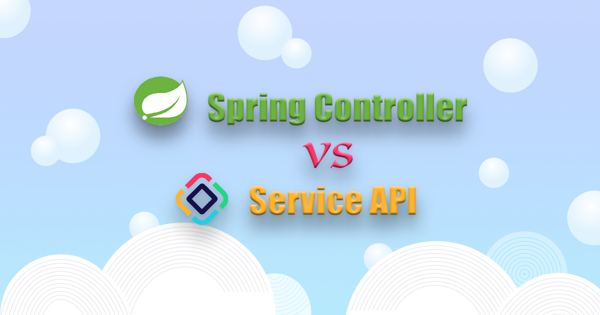

# Jmix 中 REST API 的两种实现

<p class="author">世开 Coding<span class="update-time">2022-08-24</span></p>

很多应用是采取前后端分离的方式进行开发。这种模式下，对前端的选择相对灵活，可以根据团队的擅长技能选择流行的 Angular/React/Vue 之一，或者前端为App/小程序等手机应用。Jmix 的一种典型应用场景就是作为这种类型应用程序的高级别管理 UI 和后端。为此，Jmix 提供了强大的通用 REST API 功能，支持包括开箱即用的实体、文件、元数据、用户会话的 API 以及经过简单配置就能支持的业务逻辑（服务）REST API。

由于 Jmix 是基于 Spring Boot 框架，因此也支持 Spring 的 `RestController`。那么对于 Spring 的 REST API 机制和 Jmix 提供机制，究竟有什么不同，而我们在开发时又该如何选择呢？本文将通过具体的代码示例，介绍这两种 API 的区别，相信看完之后，该如何选择您心里应该有数了。

## 数据模型和服务

我们假设一个简单的场景，为了给用户提供凑单功能，我们在后端写一个服务用于查询低于某个价格的产品（`Product`），并将满足条件的产品列表返回给客户端。

### 数据模型

首先我们构建一个简单的 JPA 实体：`Product` 类，包含名称和价格两个属性：

```java
@JmixEntity
@Table(name = "SLS_PRODUCT")
@Entity(name = "sls_Product")
public class Product {
    @JmixGeneratedValue
    @Column(name = "ID", nullable = false)
    @Id
    private UUID id;

    @InstanceName
    @Column(name = "NAME")
    private String name;

    @Column(name = "PRICE")
    private Double price;

    ... // 其他属性
}
```

?> 实体通过 Jmix Studio 创建可以选择其他[实体特性](https://docs.jmix.cn/jmix/data-model/entities.html#traits)，比如版本、实体审计、软删除属性等。

### 服务

可以像普通 Spring Boot 应用那样，自己手动创建一个 `@Service` 类。也可以通过 Jmix Studio 提供的创建 bean 的功能创建 Service。这里我们用 Jmix Studio 创建一个 Bean，该功能默认创建带 `@Component` 注解的类，我们手动将类注解修改为 `@Service`：

```java
@Service("sls_ProductService")
public class ProductService {

    @Autowired
    private DataManager dataManager; // 插入代码段时，默认注入带有权限检查的 DataManager

    public List<Product> getProductsCheaperThan(Double price){

        // 注意，这里我们并没有对输入参数 price 做检查

        List<Product> productList = dataManager.load(Product.class)
                .query("select p from sls_Product p " +
                        "where p.price < :priceInput")
                .parameter("priceInput", price)
                .list();

        return productList;
    }
}
```

?> 这里的加载实体列表代码，我们通过 Studio 的[代码段](https://docs.jmix.cn/jmix/studio/code-snippets.html)功能自动添加。

服务中，我们使用了 Jmix 的 `DataManager` 和 JPQL 查询语句加载实体，并使用方法的输入参数作为 JPQL 的参数。Jmix 的持久层也支持 Spring Data Repository 或者 MyBatis。而使用 `DataManager` 的一个好处是可以利用 Jmix 的安全机制，控制 API 调用方对实体的访问权限。

## Jmix 服务 API

Jmix 服务（Service） API 可以将任意 Spring bean 作为 HTTP 接口开放。Jmix 负责 HTTP 交互，例如，提供 HTTP 响应编码、进行错误处理等。下图是 Jmix 服务 API 的流程图：


可以看到，作为应用程序开发者，仅需要编写服务代码。另外，还需做一些配置：

1. 在项目的 resources 目录添加 rest-services.xml，用于配置可作为 REST API 使用的服务及其方法，内容如下：
  ```xml
  <?xml version="1.0" encoding="UTF-8"?>
    <services xmlns="http://jmix.io/schema/rest/services">
        <service name="sls_ProductService"> <!-- 指定服务名称 -->
            <method name="getProductsCheaperThan"> <!-- 指定方法名称 -->
                <param name="price" type="java.lang.Double"/> <!-- 指定方法参数和类型 -->
            </method>
            <!-- 可以添加服务中其他方法 -->
        </service>
        <!-- 可以添加其他服务 -->
    </services>
  ```
2. 在项目的 `application.properties` 文件中，设置 `jmix.rest.services-config` 参数，指定上面配置的 xml 文件：
  ```properties
  jmix.rest.services-config = com/abmcode/sales/rest-services.xml
  ```

完成这些配置之后，就可以通过 REST 客户端调用了，URL 为 `/rest/services/<service_name>/<method_name>`。例如，通过 Postman 调用：


!> 服务 API 会默认使用 Jmix 的安全机制：API 端口需要使用认证 token 进行访问，而且用户需要有访问 REST API 和所查询实体的权限。另外，Jmix 的服务 API 也支持[匿名访问](https://docs.jmix.cn/jmix/rest/security/authentication.html#anonymous-access)。

## Spring 控制器 API

然后我们再看看 Spring 的 `RestController` 方式。首先，我们定义一个控制器：

```java
@RestController("sls_ProductController")
@RequestMapping("/products")
public class ProductController {
    @Autowired
    private ProductService productService;

    @GetMapping("priceunder")
    public List<Product> getPriceUnder(@RequestParam Double price) throws Throwable {

        if (price < 0) {
            throw new ResponseStatusException(HttpStatus.BAD_REQUEST, "价格参数必须大于 0"); // 自定义控制器层的参数检查，抛出请求异常。
        }

        return productService.getProductsCheaperThan(price);
    }
}
```

Jmix 中的控制器接口默认都是匿名的，但是为匿名用户配置能访问实体信息又不够安全，Jmix 提供了一个应用程序属性，支持使用 Jmix 安全机制对自定义控制器进行保护：

```properties
# 支持逗号分隔的多个 pattern
jmix.rest.authenticatedUrlPatterns=/products/**
```

然后，重启服务就可以通过 Postman 进行调用。注意，这里的 URL 与服务 URL 不同，直接使用了控制器中定义的路径：


## 结论

通过上面的代码，我们可以看到，在 Jmix 中使用两种类型的 REST API 其实都不复杂，但是，也是各有优势：

**Jmix 服务 API**：
- 不用编写控制器代码，仅通过 XML 配置即可使用
- 默认使用 Jmix 的安全机制
- 可以使用 Fetch plan 定义返回实体的字段

**Spring 控制器**：
- 更加灵活，可以使用 Spring 控制器自定义 HTTP 状态码、响应类型或者异常错误
- 除了使用服务层的实体控制外，还可以在控制器层使用自定义的 DTO 对返回实体的信息做进一步控制

因此，在大多数情况下，我们仅使用 Jmix 的服务 API 就能够满足使用要求。针对部分复杂场景可以使用 Spring 控制器 API。

?> 文中使用的 Jmix 版本：1.3.1
