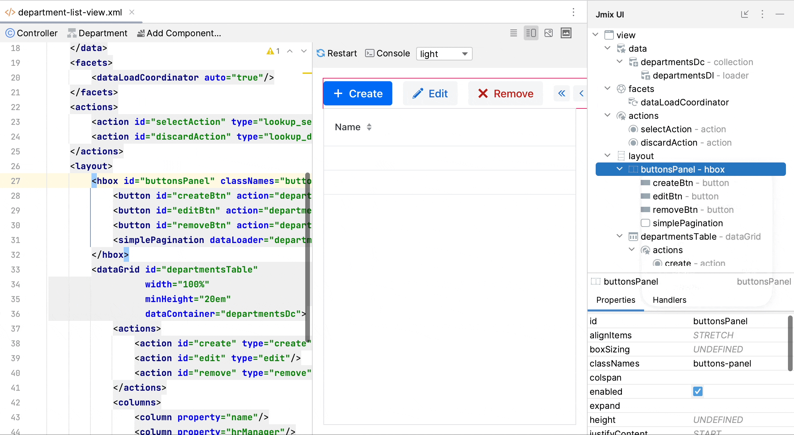
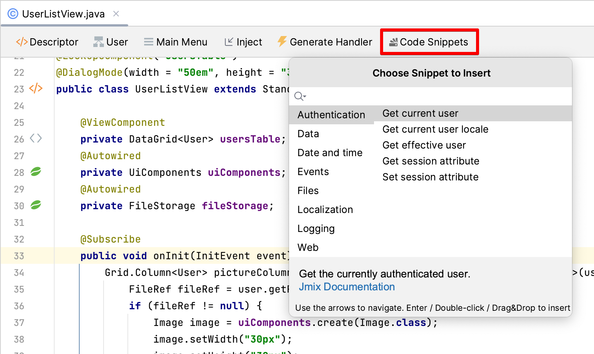
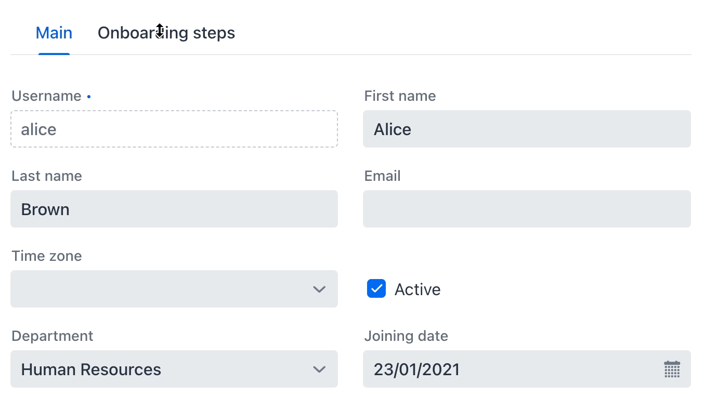
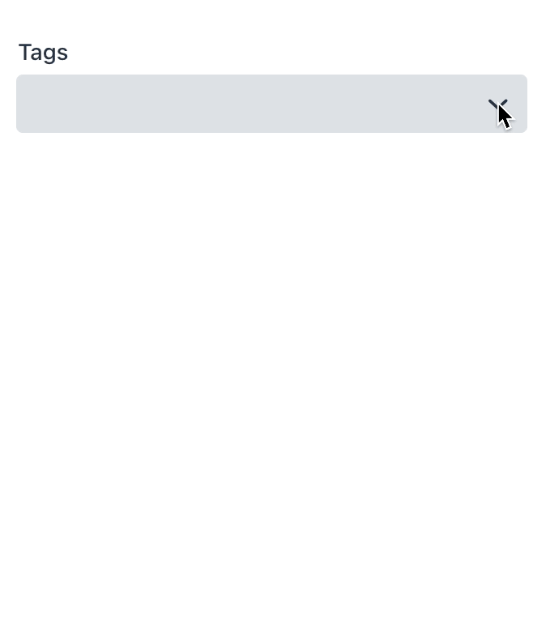
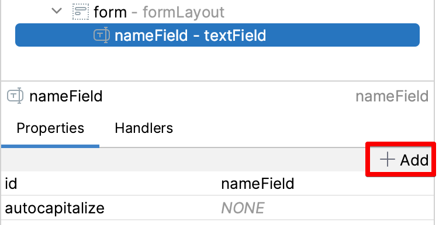
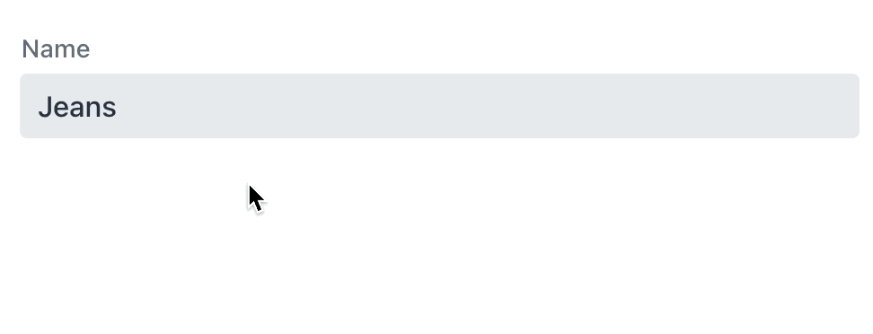
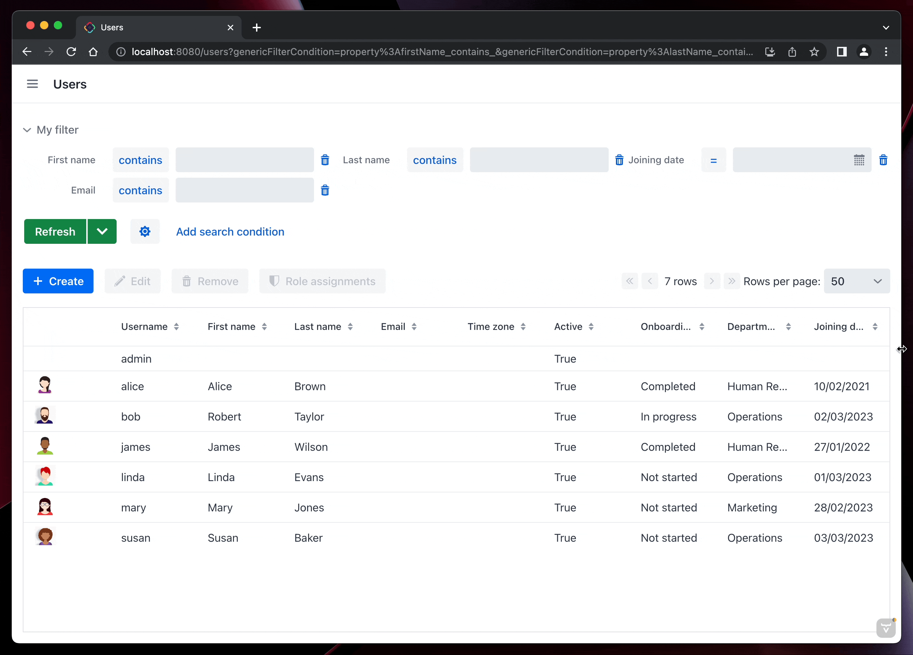
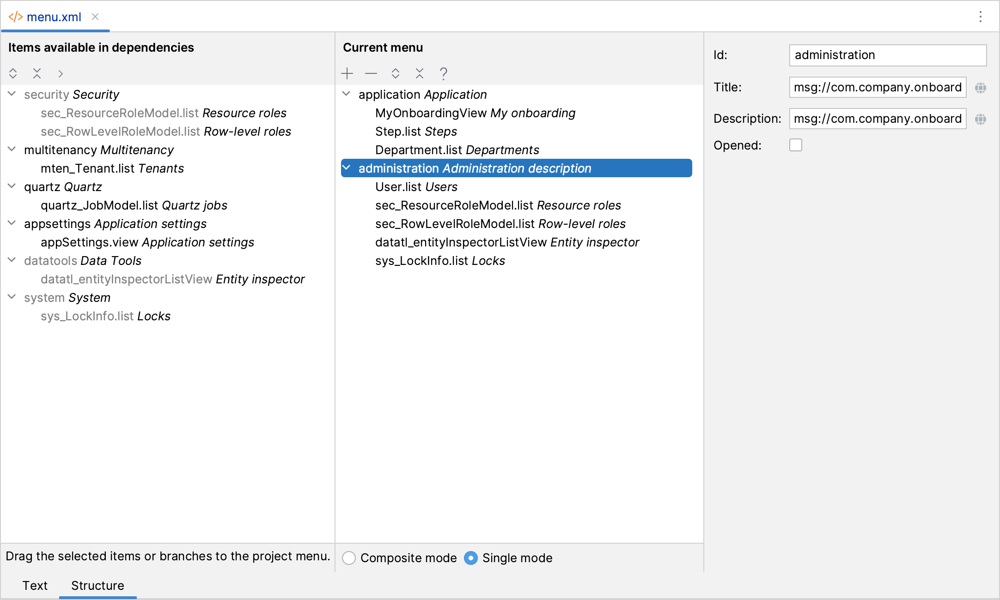
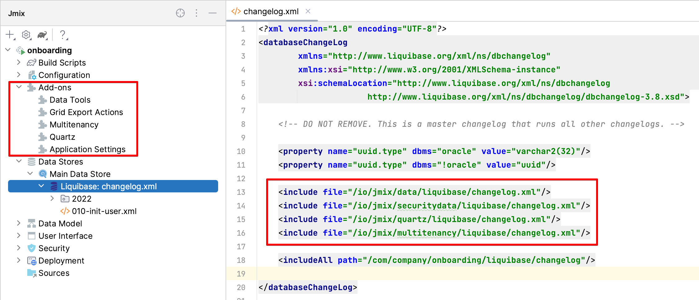

_Jmix 少代码快速开发框架 1.5 版本发布，包括框架和 Studio 的更新_

<!-- more -->
<!-- https://cdn.abmcode.com/zh-cn/jmix/releases -->

 {.center .size-8 .radius .shadow}

最近我们发布了 Jmix 的最新 1.5 正式版本。本文中，我们将介绍 1.5 版本中引入的主要新功能和改进。

如需了解更新的详细信息以及如何升级，请参考 Jmix 文档中的 [最近更新](https://docs.jmix.cn/jmix/whats-new/index.html) 部分。

## Studio UI/UX 改进

首先我们看一下在更新了 Studio 后你可能发现的一些 UI 层面的变化。

我们通过对不熟悉 Jmix 的开发者进行几轮的测试后发现，当前的 UI 可视化设计器有些过于复杂了。对于第一次使用 Studio 的用户来说，三个工具窗口和多个 XML 编辑和界面预览面板容易使人感到不知所错。另外，我们发现用户更偏向使用当前编辑器窗口顶部的操作面板，并且更习惯通过点击鼠标右键查找可用的功能。

因此，我们决定移除静态的组件工具箱面板，而改为通过几种不同的方式打开工具箱弹窗的交互模式。这几种不同的方式包括：从顶部操作面板打开，从组件层级结构的右键菜单打开，以及从源代码编辑器中的 **Generate** 菜单打开。新的工具箱弹窗支持搜索可用组件，也支持将组件拖放至 UI 层级结构或者源码中：

 {.center .size-8 .shadow}

UI 组件层级结构和组件属性面板现在合并成了单一的工具窗口，称为 Jmix UI，默认位于 IDE 的右侧。因此，UI 可视化设计器最后仅保留一个工具窗口，而组件工具箱可以通过不同的方式打开。

Studio 界面中的另一个不太好用的功能是 **Code Snippets** 工具箱。尽管对于没有 Jmix 开发经验的人来说，这个功能非常有用，但是却很难被注意到。所以，我们也修改了这个面板的展示方式：现在，在编辑 Spring bean 或者 UI 控制器时，可以通过顶部操作面板的按钮或者 **Generate** 菜单打开，并且代码段的窗口也是以弹窗的方式展示。

 {.center .size-8 .shadow .radius}

## Flow UI 改进

我们一直在持续改进 Flow UI 的功能，使其更接近作为 Jmix 中主要的 UI 技术这一目标。

在这个版本中，我们将 Flow UI 的核心升级到 Vaadin 23.3 并且集成了几个新的组件。

### TabSheet

当需要将大量 UI 组件放入单个视图时，TabSheet 是必不可少的。使用 Jmix 最常见的场景就是开发类似 ERP 这样的后台系统，而这种系统中，TabSheet 是一个典型需求。

在以前的版本中，Jmix 只提供了 Tabs 组件，该组件并不是容器，需要在不同的布局之间进行编程切换。而 Vaadin 23.3 提供了功能齐全的 TabSheet，这样我们可以完全用声明式的方式集成：

```xml
<tabSheet width="100%">
    <tab id="mainTab" label="Main">
        <formLayout id="form" dataContainer="userDc">...</formLayout>
    </tab>
    <tab id="additionalTab" label="Onboarding steps">
        <vbox>
            <hbox>...</hbox>
            <dataGrid width="100%" dataContainer="stepsDc">...</dataGrid>
        </vbox>
    </tab>
</tabSheet>
```

 {.center .size-8 .shadow .radius}

### MultiSelectComboBox

在最新的 Vaadin 中也提供了多选下拉框组件，使用该组件用户可以在下拉列表中选择多个值，并且在字段中很好地显示选择的内容。我们已经在 Jmix 集成该组件，并添加了数据绑定，因此可用于展示或修改实体的集合属性。下面的示例中，我们用这个组件管理产品和标签的多对多关系：

```xml
<instance id="productDc"
          class="com.company.demo.entity.Product">
    <fetchPlan extends="_base">
        <property name="tags" fetchPlan="_base"/>
    </fetchPlan>
    <loader/>
</instance>
<collection class="com.company.demo.entity.Tag" id="allTagsDc">
    <fetchPlan extends="_base"/>
    <loader id="allTagsDl">
        <query>
            <![CDATA[select e from Tag e]]>
        </query>
    </loader>
</collection>
<!-- ... -->
<formLayout id="form" dataContainer="productDc">
    <textField id="nameField" property="name"/>
    <multiSelectComboBox property="tags" itemsContainer="allTagsDc"/>
</formLayout>
```

 {.center .size-4 .shadow .radius}

### 上传控件

基于 Vaadin 的 Upload 组件，我们开发了两个 Flow UI 的组件：`FileStorageUploadField` 和 `FileUploadField`。前一个用来将文件上传至文件存储，返回 `FileRef` 对象，可以保存在实体属性中。后一个返回字节数组，这个字节数组是直接保存在一个实体中的。

这两个组件的声明式用法非常简单：只需要设置一个带有实体实例的数据容器，然后配置 `FileRef` 或字节数组类型的实体属性名称即可：

```xml
<fileStorageUploadField id="uploadField"
        dataContainer="userDc" property="picture"/>
```

### 图片

图片组件现在也支持 Jmix 的数据绑定，可以绑定至 `FileRef` 或字节数组类型的实体属性：

```xml
<image id="image"
        dataContainer="userDc" property="picture"
        height="280px" width="200px" classNames="user-picture"/>
```

如果需要配置图片的放置方式，可以用 CSS 样式。例如，需要在缩放图像同时保持其宽高比，可以创建下面这个 CSS 类，并在组件的 `classNames` 属性中指定：

```css
.user-picture {  
    object-fit: contain;  
}
```

### Tooltip

Tooltip（提示窗）可以在 UI 组件旁边的小弹窗中展示组件的附加信息。鼠标悬停或者键盘聚焦都可以维持它的展示状态。

对于支持提示窗的组件，Studio UI 设计器会在组件属性面板展示 _Add_ 按钮：

 {.center .size-4 .shadow .radius}

在 XML 中则是通过组件内部的元素定义：

```xml
<textField id="nameField" property="name">
    <tooltip text="Product name" position="BOTTOM_START"/>
</textField>
```

 {.center .size-6 .shadow .radius}

### 通用过滤器

过滤器是经典 UI 中最受欢迎的组件之一，支持用户根据不同的条件筛选数据，包括实体属性、引用、JPQL 查询和条件运算符。打个形象的比喻，过滤器就像是一把用于结构化数据搜索的瑞士军刀，开发人员只需在界面中放置过滤器，用户就可以自定义并按需使用。

在 Jmix 1.5，我们在 Flow UI 中添加了具有基本功能的通用过滤器：用户可以基于整个实体关系图创建任意数量的属性条件。与 Flow UI 中的其他组件一样，过滤器也是响应式的：

 {.center .size-8 .shadow .radius}

而且，对于响应式的 breakpoints，过滤器还支持在其内部 XML 元素 `responsiveSteps` 进行配置：

```xml
<genericFilter id="filter" dataLoader="usersDl"
			   summaryText="My filter">
	<responsiveSteps>
		<responsiveStep minWidth="0" columns="1"/>
		<responsiveStep minWidth="800px" columns="2"/>
		<responsiveStep minWidth="1200px" columns="3"/>
	</responsiveSteps>
</genericFilter>
```

显然，过滤器是有状态的，而且在不同的视图之间导航或刷新网页时应保持其状态。否则，用户设置过的筛选条件将会丢失，例如，在详情页编辑数据后返回列表页的情况。Jmix 提供了 `queryParameters` facet，用于保存当前 URL 和筛选条件的映射，这样可以确保在不同的视图间导航时过滤器能保持正确的过滤状态，并且能提供包括筛选条件在内的页面深度链接（Deep link）。Facet 的最简单配置就是直接设置它所控制的过滤器组件：

```xml
<facets>
    <queryParameters>
        <genericFilter component="filter"/>
    </queryParameters>
</facets>
```

通用过滤器的研发还在继续，我们计划在 2023 年 6 月的版本中让 Flow UI 的过滤器具有通用 UI 过滤器的所有功能。

### 带有 Flow UI 的扩展组件

在 1.5 中，我们为下列开源组件提供了 Flow UI：
- 多租户
- Quartz 定时任务
- 应用程序设置
- 表格导出操作

在使用 Flow UI 的项目中可以直接通过 Studio 的扩展组件市场安装。

### Flow UI 菜单

Flow UI 中的主菜单结构与经典 UI 不同：每个扩展组件都有自己的根节点菜单、有预定义的顺序，而且没有通用的 “管理” 菜单。对于试验和原型系统来说，这种默认的菜单结构已经够用，但对于实际的应用来说，往往还是需要一个自定义的菜单结构。因此，可以从 “Composite” 模式切换到 “Single” 模式并定义自己的菜单结构。

以前，许多开发人员尽可能避免使用 “Single” 模式，因为在项目中添加新扩展组件时，这种模式会有问题：新扩展组件的菜单项没有出现在主菜单中，并且不清楚要怎么添加。

现在，这个问题已经在 Flow UI 的菜单设计器中得到解决。一旦切换到 “Single” 模式，设计器就会在左侧显示一个包含扩展组件所有菜单项的面板，这些菜单也可以在主菜单使用。这样一来，在添加了新的扩展组件之后，只需要将扩展组件的菜单拖放到主菜单中合适的位置即可。

 {.center .size-8 .shadow .radius}

## Excel 导出

Jmix 应用程序中最常用的功能之一是能够一键将 UI 表格中展示的数据导出到 Excel。这个功能在最初设计时是用来精确导出用户当前能看到的所有数据，即通过过滤器选择的当前页面的数据。但是很多时候用户希望能导出过滤器筛选的所有数据，而不仅仅是当前页面。

在 1.5 中，我们改进了表格导出操作扩展组件提供的 `excelExport` 操作。现在，如果用户在导出对话框中选择 “所有行”，则会导出所有数据。考虑到性能和服务器内存使用情况，数据加载会分批次执行。

该功能同时支持经典 UI 和 Flow UI。

## 悲观锁 UI

Jmix 现在提供了一个用于管理悲观锁的默认 UI。位于经典 UI 的 “管理” 菜单和 Flow UI 的 “系统” 菜单中。

系统管理员可以查看当前锁的列表，并在需要时进行手动删除。

## Liquibase changelog

Jmix 的一个优势是能帮助开发人员创建和运行用于数据库版本控制的 Liquibase changelog。Studio 会针对数据模型和数据库结构之间的差异生成 changelog，并在启动应用程序时运行这些更改脚本。因此，当在测试或生产环境中启动一个新版本的应用时，会自动在连接的数据库上运行那些新添加的 changelog。

但是，这个简单的流程并不能满足所有的需求，有时候需要在没有 Studio 或应用程序的情况下运行 Liquibase，比如，在一个 CI 服务器上通过 Liquibase CLI 或 Gradle 插件运行 changelog。

在以前的版本中，这是不可能实现的，因为项目的 root changelog 文件没有定义扩展组件提供的数据库变更。但是 changelog 能正确运行是因为，Jmix 会从项目配置中获取使用的扩展组件信息，并在运行 Liquibase 之前在内存中动态创建正确的 changelog。

从 Jmix 1.5 开始，我们修改了这个机制，项目的 root changelog 文件始终是完整的，可以通过 Liquibase CLI 或 Gradle 插件执行。每当添加或删除扩展组件时，Studio 都会自动更新 changelog 包含新的内容。此外，当启动应用程序时，Studio 会检查 root changelog 中包含的内容与项目的扩展组件是否匹配。如果发现不匹配，Studio 会显示通知对话框，并建议添加或删除对扩展组件 changelog 的引入。

Jmix 工具窗口中，通过双击数据存储下的 Liquibase 节点即可打开 root changelog：

 {.center .size-8 .shadow .radius}

## 下一步？

下一个 Jmix 的功能版本将在 2023 年 6 月发布，在这个版本中，我们将更新框架底层技术栈的版本，包括 Spring、Spring Boot、Eclipselink 以及 Vaadin。这次更新后，将会要求最低使用 Java 17 作为开发和运行 Jmix 程序的基线版本。

另一个重要的里程碑是为报表和 BPM 扩展组件实现 Flow UI 的界面模块。

未来版本的详细路线图请访问 [GitHub 项目](https://github.com/orgs/jmix-framework/projects/5)。1.5 的后续补丁版本会按照大约每个月一次的频率发布，提供常规更新和升级。

欢迎通过我们的 [论坛](https://forum.jmix.cn) 提供反馈和问题。谢谢大家对 Jmix 的支持和建议！
