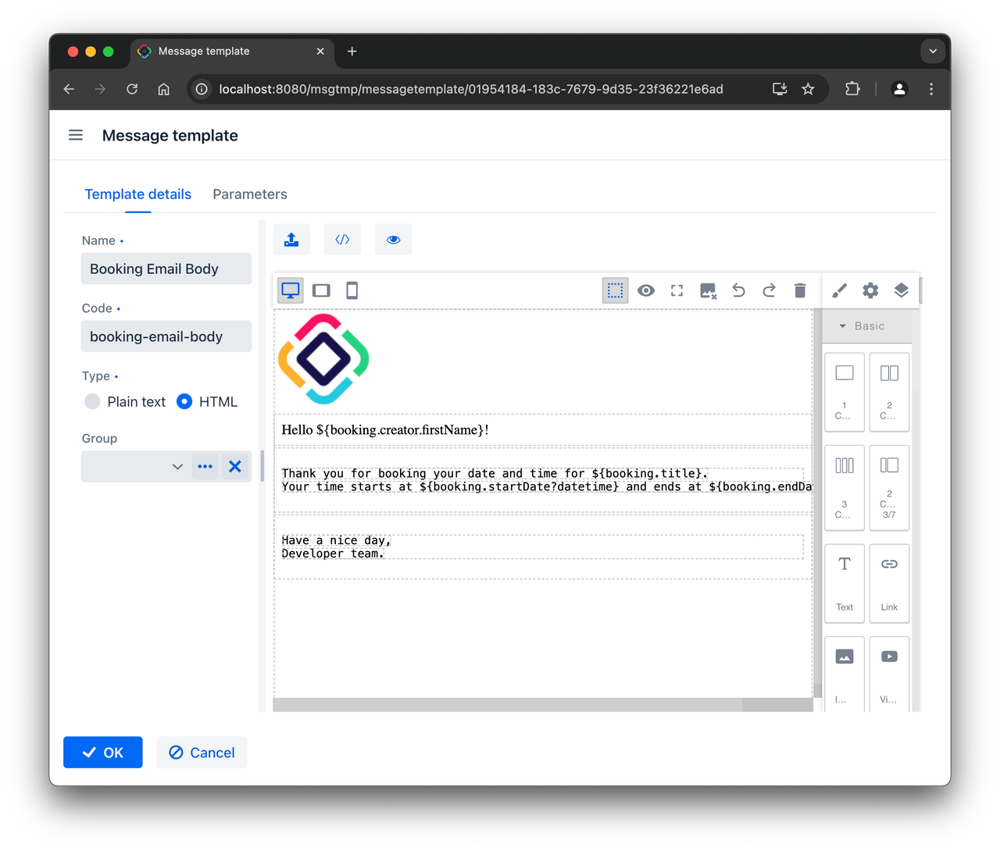
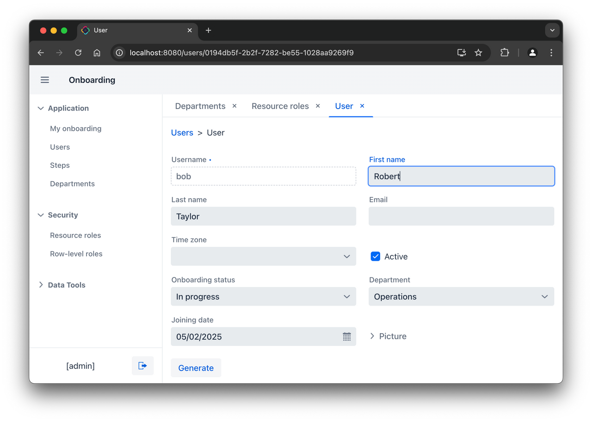
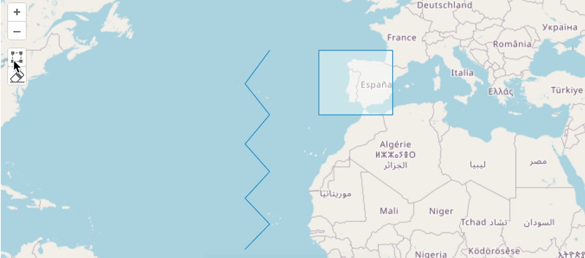
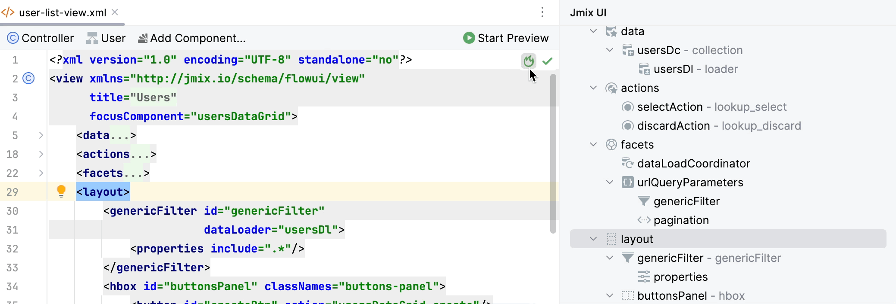
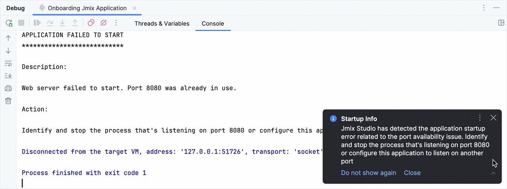
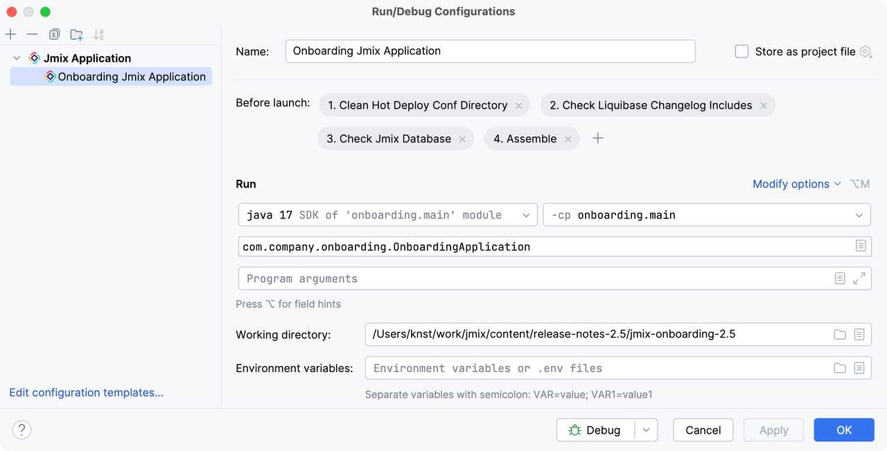
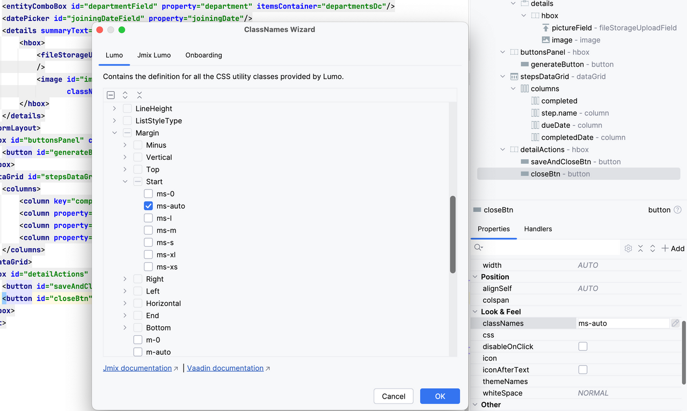
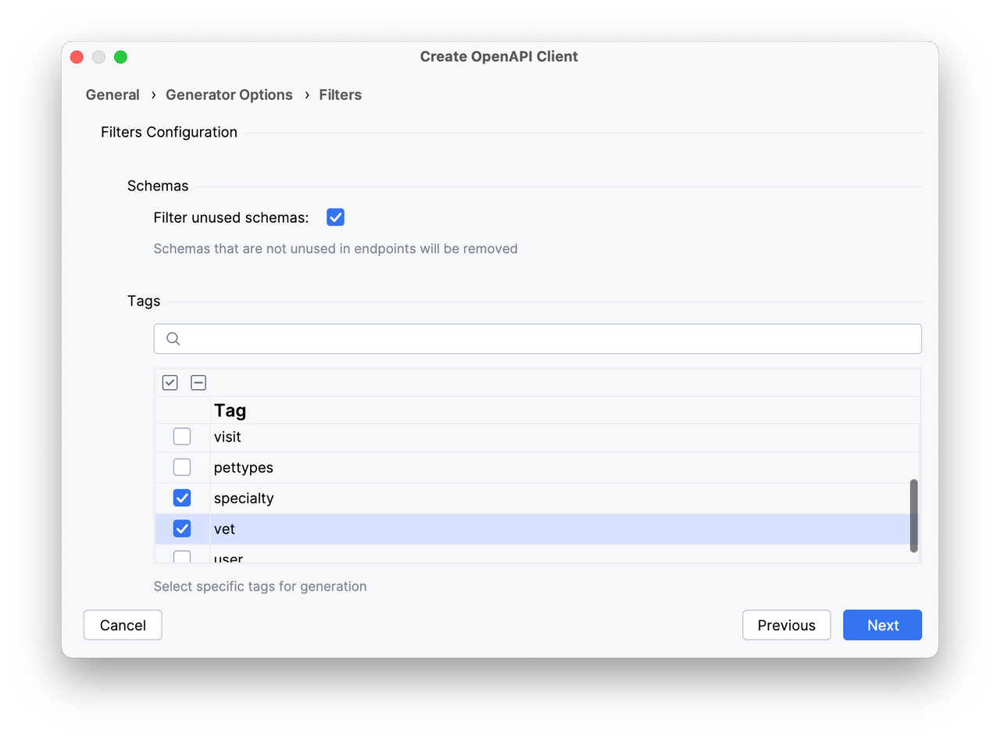
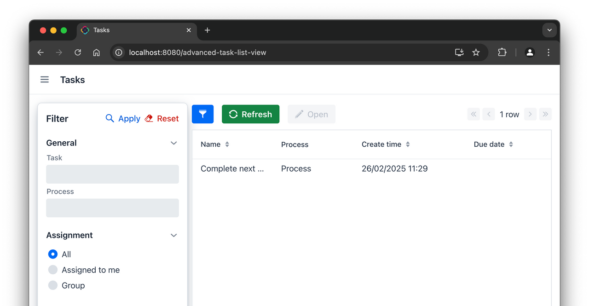
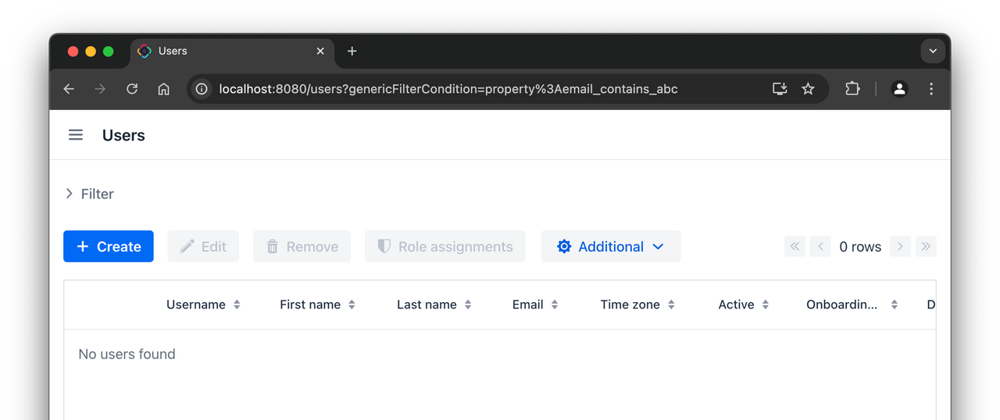

_Jmix 少代码快速开发框架 2.5 版本发布，包括框架和 Studio 的更新_

<!-- more -->

 {.center .size-8 .radius .shadow}

Jmix 团队很高兴宣布 Jmix 2.5 版本正式发布。此版本带来了许多新功能、改进与更新，目的在于提升开发效率。该版本主要关注开发生产力的提升、提供更多扩展和集成的选项以及引入新的功能。完整变更说明及升级指南请访问文档中的 [最近更新](https://docs.jmix.cn/jmix/whats-new/index.html) 页面。

以下是Jmix 2.5的核心功能概览：

消息模板扩展组件
-----------

**消息模板（Message Template）** 扩展组件提供了灵活管理可重用消息模板的功能。开发者可在模板中定义占位符，然后在运行时动态填充数据，简化了个性化消息（如邮件或应用内通知）的创建流程。

消息的生成流程基于 **Apache FreeMarker** 模板引擎，支持 HTML 与纯文本模板。并集成了 **GrapesJS** 可视化编辑器，可通拖放预定义的 HTML 模块快速设计模板：

 {.center .size-8 }

该插件支持与 Jmix 的其他扩展组件（多租户、邮件发送、通知）集成。

多标签应用模式
---------------------

**Tabbed App Mode** 扩展组件（当前为试验版本）支持在主视图内以独立标签页形式打开应用的视图，提供类似桌面企业应用的整合导航体验：

 {.center .size-8}

## 地图对象编辑

**Maps** 扩展组件新增对矢量图层要素的选取、移动与修改，方便直接在应用中编辑地图数据：

 {.center .size-8  .shadow}

Studio改进
---------

### 热部署状态指示

在支持热部署的文件（如视图控制器、描述符、消息包、角色文件）右上角新增状态图标，实时显示变更是否已生效：

 {.center .size-8 .radius .shadow}

### 应用日志分析

Studio可识别控制台常见异常并提供解决方案建议，结合热部署指示器显著提升调试效率：

 {.center .size-8 .radius .shadow}

### Jmix 专属运行配置

新增替代标准 Gradle 配置的 Jmix 运行/调试配置，确保应用能优雅地关闭且控制台无报错：

 {.center .size-8 .radius .shadow}

### CSS 类名编辑器与自动补全

优化对 UI 组件的 `classNames` 属性输入支持，提供类名自动补全建议，并通过可视化编辑器快速选择样式：

 {.center .size-8 .radius .shadow}

### 按标签生成 OpenAPI 客户端

生成 OpenAPI 客户端代码时支持按标签筛选，自动过滤未使用的 Schema，减少冗余代码生成：

 {.center .size-8 }

高级 BPM 任务列表视图
-----------------

通过视图创建向导中的 **BPM: Advanced task list view** 模板生成功能更丰富的任务列表视图，支持深度定制：

 {.center .size-8  }

表格空状态组件
----------------

`DataGrid` 组件新增 `emptyStateComponent` 和 `emptyStateText` 属性，支持无数据时显示自定义内容，提升用户体验：

 {.center .size-8  }

REST API 与 REST 数据存储改进
--------------------

**通用 REST** 端点除了能接收命名 fetch plan 之外，现支持接收任意 JSON 格式的 fetch plan，减少预定义 fetch plan 的需求并简化了 REST API 的集成。同时，这个改动也简化了 REST 数据存储的使用：客户端和服务端无需在共享仓库中定义共同的 fetch plan，而可直接在视图或 Java 代码中内联指定。

**REST DataStore** 新增与远程应用文件存储对接的 `FileStorage` 实现，可无缝实现远端文件存储的集成。

UUIDv7 实体标识符
--------------

Jmix 2.5 现在默认使用基于时间戳的 **UUIDv7** 生成 `@JmixGeneratedValue` 注解的 UUID 属性，优化了数据库索引性能与查询效率。

依赖项更新
--------

Jmix 2.5 升级了核心依赖：

* Spring Boot 升级至 3.4
* Vaadin 升级至 24.6

这些更新确保能确保 Jmix 的现代、安全和高性能。

未来计划
-------------------

下一个功能版本预计在 2025 年 6 月发布，我们将聚焦：

* Studio 集成 AI 助手
* 正式版多标签应用组件
* SAML 认证组件
* 开关（Toggle）UI 组件
* 端到端 UI 测试库，类经典 UI 中的 Masquerade

结语
----

Jmix 2.5 通过多项创新持续赋能开发者，提高开发者的效率，为项目增加集成能力和更多的功能。欢迎加入 [论坛](https://forum.jmix.cn ) 参与讨论，感谢社区成员的贡献！

期待 Jmix 2.5 能为您的项目提供更多帮助！

--- 