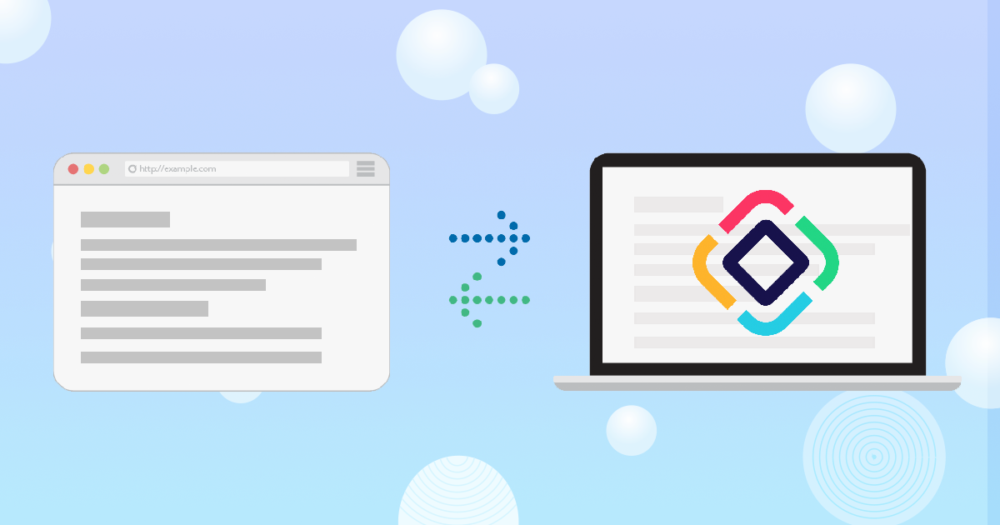
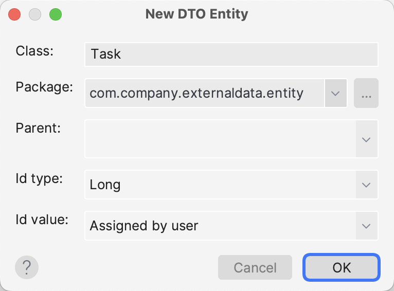
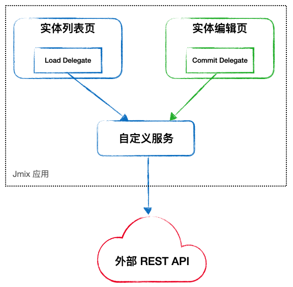
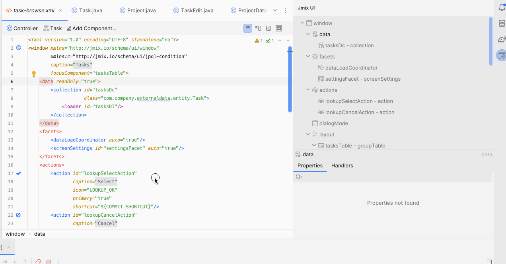
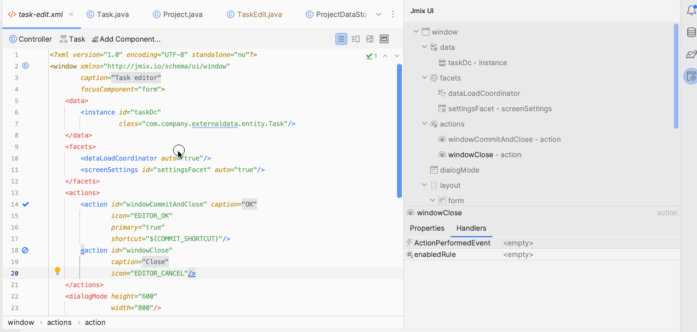
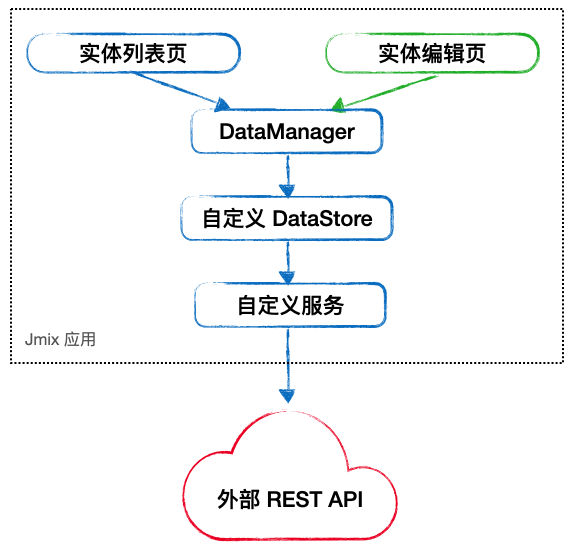

_通常我们需要手动处理外部数据，但是 Jmix 能做到从底层支持_

<!-- more -->


 {.center .size-8 .radius .shadow}

<!-- # 大标题 -->

企业级应用中，通常一个业务系统并不是孤立存在的，而是需要与企业、部门或者是外部的已有系统进行集成。一般而言，系统集成的数据和接口交互方式通常有以下几种：

1. 文件传输：通过文件传输的方式将数据传递给其他系统，例如使用 FTP 或 SFTP 等协议传送文件。这种交互方式适合单向或批量数据传输。
2. Web 服务 API：使用 API 与其他系统进行通信，一般采用 SOAP 或 REST 等通信协议。这种交互方式可用于实现单向或双向数据传输。
3. 数据库交互：使用数据库共享的方式，或者通过数据库连接进行数据交换。这种交互方式在双向数据同步和实时数据交换方面非常有效。但是一定要注意数据权限控制和数据安全。
4. 消息队列：通过消息队列进行数据的收发，而无需与其他系统直接通信。消息队列可用于处理大量数据以及异步数据传输的情况。

不论使用那种方式进行通信和传输，在主系统（即，正在实施的系统）中，还需要考虑的一个问题是，第三方系统过来的数据需不需要保存？如果主系统要基于接入的数据进行进一步处理，则通常需要保存数据。而有时候由于数据安全方面的原因，亦或是考虑到本地存储数据后还存在数据同步与重复存储的问题，第三方系统的数据过来后，主系统并不需要存储数据，只是提供展示和操作界面。

本文中，我们以常见的 REST API 通信为例，看看 Jmix 应用是如何直接使用外部数据的（这里我们不存储外部数据）。

<!-- 如果你还不了解什么是 Jmix 快速开发框架，请手下这份评估指南： -->

## 外部数据源

我们假设外部数据源通过 REST API 提供关于项目（project）和任务（task）的 CRUD 接口。

## 定义 DTO 和 Service

首先，我们在主系统中定义两个 DTO 实体：`Project` 和 `Task`，用 Jmix Studio 可以直接创建 DTO 实体：

 {.center .size-5 .radius .shadow}

然后，在主系统中我们需要定义两个 Services，专门用来对 `Project` 和 `Task` 实体进行 CRUD 操作，而这些操作里面，其实是调用了外部系统提供的 REST 接口，以 `TaskService` 为例：

```java
@Component
public class TaskService {

    public static final String TASKS_BASE_URL = "http://localhost:18080/tasks";

    @Autowired
    private RestTemplate restTemplate;

    public List<Task> loadTasks() {
        Task[] tasks = restTemplate.getForObject(TASKS_BASE_URL, Task[].class);
        return Arrays.asList(tasks);
    }

    public Task saveTask(Task task) {
        String url = task.getId() != null ?
                TASKS_BASE_URL + "/"  + task.getId() :
                TASKS_BASE_URL;
        ResponseEntity<Task> response = restTemplate.postForEntity(url, task, Task.class);
        return response.getBody();
    }

    public void deleteTask(Task task) {
        restTemplate.delete(TASKS_BASE_URL + "/" + task.getId());
    }
}
```

`Project` DTO 的创建过程和 `ProjectService` 的内容与上面步骤类似，这里就不再赘述。

## 第一种方式：使用代理

第一种方式是使用数据加载代理和提交代理方法，将原本使用 `DataManager` 进行数据加载和写入的相应方法替换为使用我们自定义的服务:

 {.center .size-5 .radius }

这里，我们选择 `Task` DTO 和它的列表页和编辑页作为示例。

首先，在列表页添加数据加载的代理，在界面选中数据加载器后，双击代理方法中的 `<empty>` 标签，Studio 会自动生成方法并跳转到方法定义，添加自定义逻辑：

 {.center .size-10 .radius }

然后，在编辑页添加数据提交代理，这里需要在 XML 中选中 `data` 节点，然后双击生成 `commitDelegate`：

 {.center .size-10 .radius }

这样就完成了我们需要实现的功能。是不是很简单？

## 第二种方式：自定义数据存储

Jmix 中，数据存储可以进行自定义，通过自定义的数据存储，可以像处理 JPA 实体一样，使用 `DataManager` 处理 DTO 实体。在检测到 DTO 实体关联到某个自定义存储后，`DataManager` 会将 CRUD 操作都通过代理执行，并且能处理对 DTO 实体的引用。具体实现框架如下：

 {.center .size-5 .radius }

可以看到，使用这种方式不需要对界面中的实体操作进行拦截，而是将所有对于外部系统的接口调用都交给 `DataManager` 通过数据存储进行分发。

这里，我们选择 `Project` DTO 作为示例，创建相应的数据存储：

1. 创建 `ProjectDataStore` 实现 `DataStore` 接口：
```java
@Component("sample_ProjectDataStore")
@Scope(BeanDefinition.SCOPE_PROTOTYPE)
public class ProjectDataStore implements DataStore {

    // 注入 ProjectService 用于具体的操作
    @Autowired
    private ProjectService projectService;

    // 后面需要实现接口中的方法，主要是通过 projectService 对数据进行 CRUD，这里省略。
    ...
}
```

2. 创建一个实现 `StoreDescriptor` 接口的类。必须是一个 Spring 单例 bean，其中 `getBeanName()` 方法必须返回上一步创建的 bean 的名称：

```java
@Component("sample_ProjectDataStoreDescriptor")
public class ProjectDataStoreDescriptor implements StoreDescriptor {

    @Override
    public String getBeanName() {
        return "sample_ProjectDataStore";
    }

    @Override
    public boolean isJpa() {
        return false;
    }
}
```

3. 在 `application.properties` 中添加对数据存储的配置：
```ini
# 如果有多个，则以逗号分隔
jmix.core.additional-stores = projectds
# 配置名称为 jmix.core.storeDescriptor_<store_name>
jmix.core.store-descriptor_projectds = sample_ProjectDataStoreDescriptor

```

4. 为 `Project` 实体添加 `@Store` 注解：
```java
@Store(name = "projectds")
@JmixEntity
public class Project {
    ...
}
```

通过这几步，我们完成了数据存储的实现和配置。`Project` 的列表页和编辑也不需要做任何改动，并且，任何通过 `DataManager` 对 `Project` DTO 的操作就像操作 JPA 实体一样方便，可以在服务层和 UI 层调用。

## 结论

如果外部 API 提供了丰富的操作接口，比如 CRUD、分页、排序甚至支持某种查询语言，那么我们推荐创建一个自定义的数据存储。这种为数据操作 Service 提供自定义数据存储的方式，更贴近 Jmix 原生的开发方式。另外，如果需要的话，自定义的数据存储也可以继承 `AbstractDataStore` 类，这个类是 Jmix 内置 `JpaDataStore` 的父类。通过这个类派生可以使用框架提供的一些机制，比如数据访问安全和对外部数据的审计。

但是如果外部 API 只提供了几个简单的接口，这种情况我们建议直接在 UI 层使用数据读写代理的方式。

示例的完整代码请访问 [GitHub](https://github.com/jmix-framework/jmix-samples/tree/main/external-data-sample)
