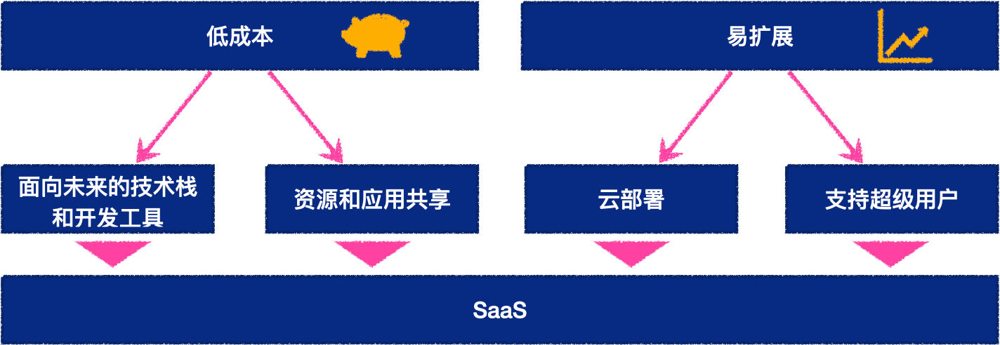
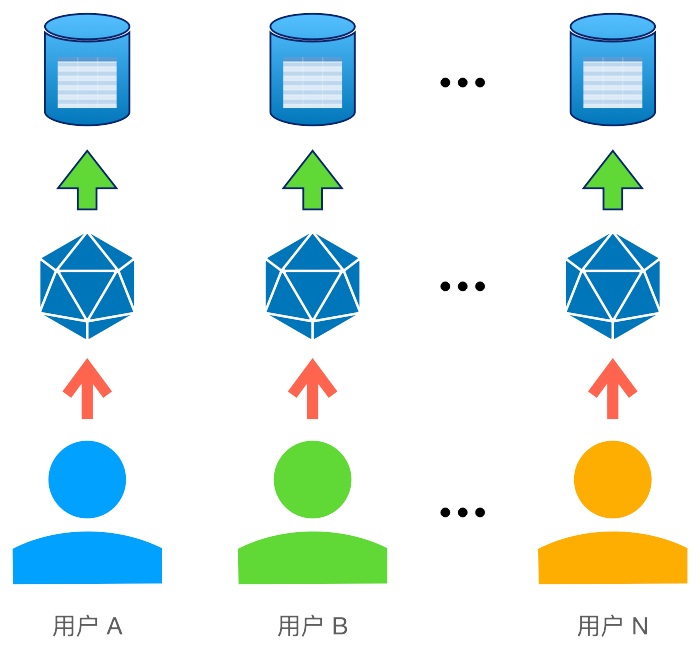
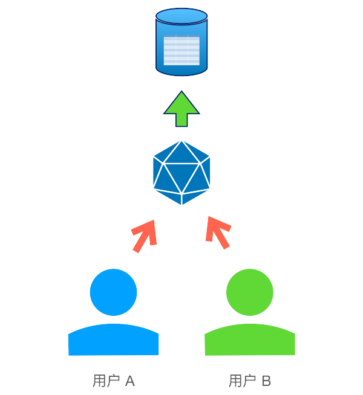
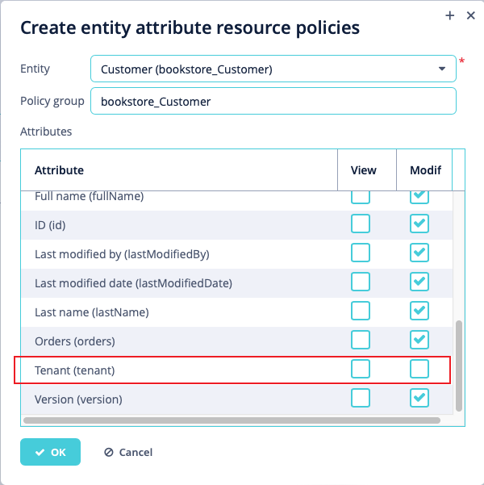
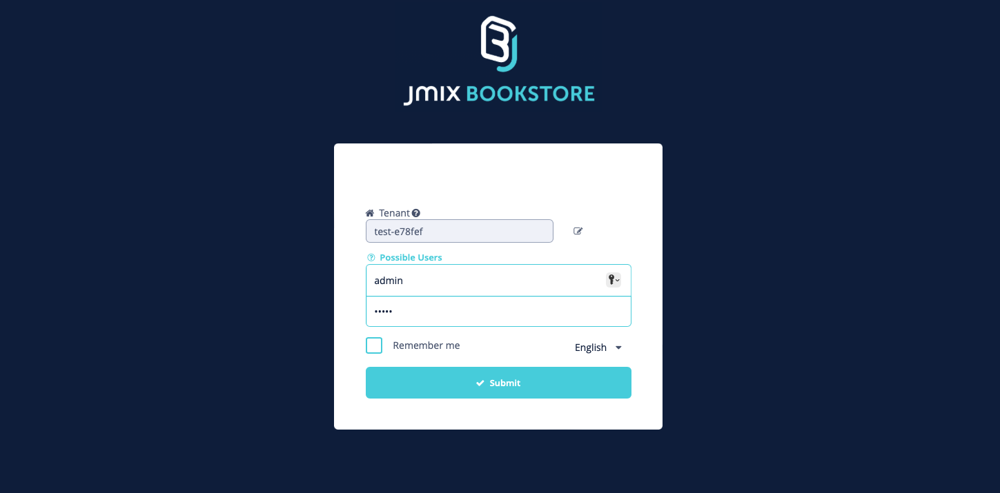
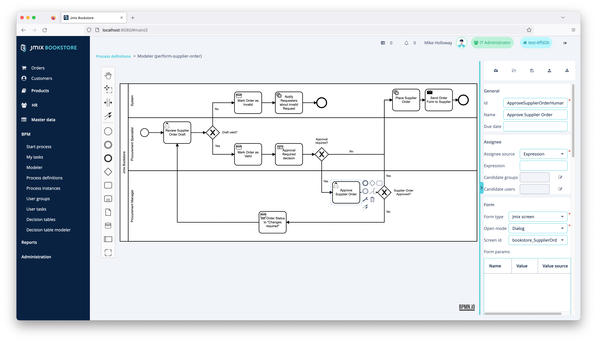

_多租户SaaS系统有低成本和易扩展的优势，Jmix Web快速开发平台是如何实现多租户场景的？_

<!-- more -->


 {.center .size-8 .radius .shadow}

<!-- # 大标题 -->

## 多租户应用起源

记得笔者在刚上大学那会（2000年代初），寝室的电脑是大家一起凑钱“攒”的。那时候网络并没有现在这么发达，根本没有线上购物这种东西。买电脑得去电脑城挨宰，而操作系统和各种软件，只能从买到的光盘里安装，对，就是那种“办公软件10合1”，“装机工具大全”之类的。后来，互联网发展很快，到现在带宽能达几百兆，上千兆的网络了。我们再也不用去实体店攒电脑了，软件也可以直接从网上下载。

在企业级软件领域，以前也是需要通过光盘作为介质进行分发，有时候复杂的软件还需要销售人员上门安装。随着网络和硬件的发展，基于浏览器的Web企业级应用开始出现，这种应用只需要在公司的服务器安装服务，所有员工打开浏览器就能使用。这种方式虽然比在每台电脑上安装软件方便多了，但还是需要人员上门安装。不过这种方式也有特别适合的场景，比如不能访问公共网络的纯内网环境，或者一些对安全性要求较高环境。

而对于安全性要求不高的一些领域，SaaS（软件即服务）模型提供了一种成本更低的分发模式。用户不需要购买任何专属硬件和软件，仅需要购买软件的访问权限，通过互联网即可使用服务。对于软件供应商来说，虽然SaaS模式相比以前简单了不少，但是为每个客户都部署一次软件实例仍然不是一件简单的事情，因此软件开发人员开始使用多租户架构来简化部署和维护过程。

多租户是一种软件服务运营模式，在这种模式下，多个或一个应用程序的多个实例在一个共享的环境中运行，实例（租户）之间仅存在逻辑隔离，在物理上是一体的。大学的公寓就是一个典型的多租户场景，水、电、厕所都属于大家共享的公共资源，各个寝室则属于租户资源，不与他人共享。

SaaS多租户服务有这几个显著的特点：

 {.center .size-8 .radius .shadow}

## 技术栈和开发工具

由于SaaS服务是一个长期的在线服务，因此，选择面向未来的技术栈至关重要。Jmix采用了面向未来的技术栈，关于Jmix介绍，请访问：[Jmix 少代码快速开发平台](../jmix-introduction.md)

## 资源和应用共享

资源和应用共享有多种方式，常见的就是多实例应用和多租户应用。

### 多实例应用

多实例应用，顾名思义，就是为不同的客户运行不同的产品实例，下图是一个典型的多实例应用部署结构：

 {.center .size-4 .radius .shadow}

可以看到，在多实例应用场景中，每个客户拥有独立的数据库、应用、以及访问权限管理。

这种模式的优点是，客户之间的数据相互独立，互不干扰。有新客户来了，就新起一套服务。但是缺点也很明显，如果核心功能有升级或者重大问题修复，那么需要每个实例都更新一遍。而如果不同客户有不同的需求、不同的产品配置、报表，将会导致系统维护困难。笔者当年工作过的BOSS系统，就是基本每个客户都有一个定制的代码分支。

以上这两点会导致系统的维护成本增高，并且不利于产品的创新和扩展。

### 共享应用

在共享应用的场景中，所有用户访问的是同一个应用，具有共享的数据库和统一的访问权限管理，即，逻辑分离、物理统一的应用，每个用户成为一个租户：

 {.center .size-3 .radius .shadow}

在这种场景下，系统的数据就自然分成了两类，一类是所有租户共享的公共数据，另一类则是租户特定的业务数据，这类数据是租户独享的。因此，能支持对不同租户进行数据隔离的数据安全措施变得尤为重要。

还有一点，在多实例应用中很容易实现的客户定制化需求，在共享应用中变得复杂起来，特别是需要通过配置实现不同租户之间的差异化定制需求。

## Jmix 支持多租户

Jmix提供扩展组件支持多租户场景：
1. 单一数据库上支持多租户，支持两种类型的数据：租户间共享数据、租户特定数据。
2. 每个租户可以创建自己的用户并分配基于租户的角色。
3. 租户数据保存在数据库同一schema中，并使用相同的表格。

### 原理

多租户扩展组件的实现原理其实非常简单，就是要求针对租户特定的实体，需要添加一个 `String` 类型的参数，并使用 `@TenantId` 注解。然后在运行任何查询语句时，框架底层会自动将用户的租户ID添加到查询条件中，实现了仅读取用户所在的租户数据。而在保存实体时，数据的租户ID会自动设置为当前用户的租户ID。因此，系统的用户表（User）必须添加租户ID属性，没有租户ID的用户能看到所有的数据（全局管理员）。

```java
@JmixEntity
@Entity(name = "bookstore_User")
@Table(name = "BOOKSTORE_USER")
public class User implements JmixUserDetails, HasTimeZone, AcceptsTenant {

    @Id
    @Column(name = "ID", nullable = false)
    @JmixGeneratedValue
    private UUID id;

    // 租户ID
    @TenantId
    @Column(name = "TENANT")
    private String tenant;

    ...
}
```

### 安全配置

在多租户系统中，租户的内部数据是至关重要的，Jmix框架在底层通过用户的租户ID自动使用系统的安全机制。但是在配置租户角色时，**一定不能选中对租户ID修改的支持**。

 {.center .size-5 .radius .shadow}

Jmix的安全机制在租户范围内起作用，系统中的其他模块，包括报表、BPM、日志等，也都自动支持多租户。

### 云部署支持

SaaS服务的一个本质要求就是能支持云端部署，并且具有可扩展性。Jmix基于Spring Boot构建，支持“云原生”技术，既可单独部署，又支持通过Docker容器进行部署。

### 超级用户

多租户应用该如何应对不同租户的不同定制化需求？首先能想到的就是功能尽量松耦合、模块化，并通过与租户绑定的开关进行开启或关闭。其次，对于一些通用功能，需要有超级管理员（即不属于任何租户的超级用户）进行配置。Jmix核心功能和扩展组件功能都支持超级用户在运行时进行配置，例如，通用数据过滤器，数据导出组件，报表，BPM流程，等等。

## Jmix Bookstore 示例

Jmix提供了一个多租户的示例程序 - Jmix书店：
- Demo 地址为：https://demo.jmix.io/bookstore
- 源码地址为：https://github.com/jmix-framework/jmix-bookstore

其中，书店的数据是多租户隔离的，包括客户、订单、产品、报表、BPM等，并支持动态创建新的租户。

 {.center .size-8 .radius .shadow}

 {.center .size-8 .radius}

## 总结

使用Jmix可以很容易在共享数据库上创建多租户应用，其核心框架和扩展组件均支持多租户系统。Jmix提供安全管理的统一机制，包括支持租户特定的角色。在DevOps和运维方面，Jmix支持云端部署，支持弹性资源伸缩，并且支持超级用户，可以在运行时对定制化需求做配置。

