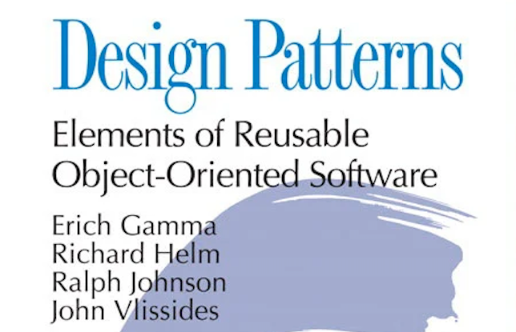
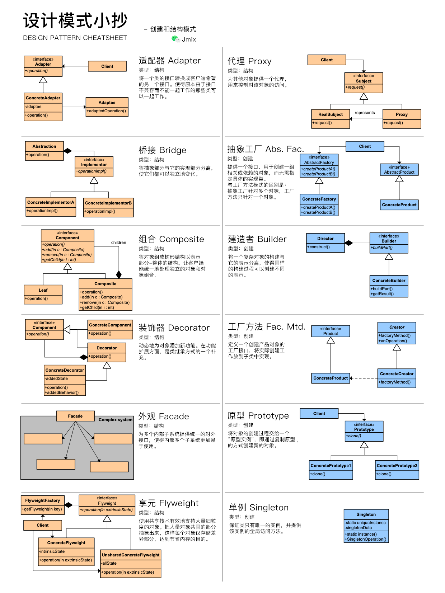
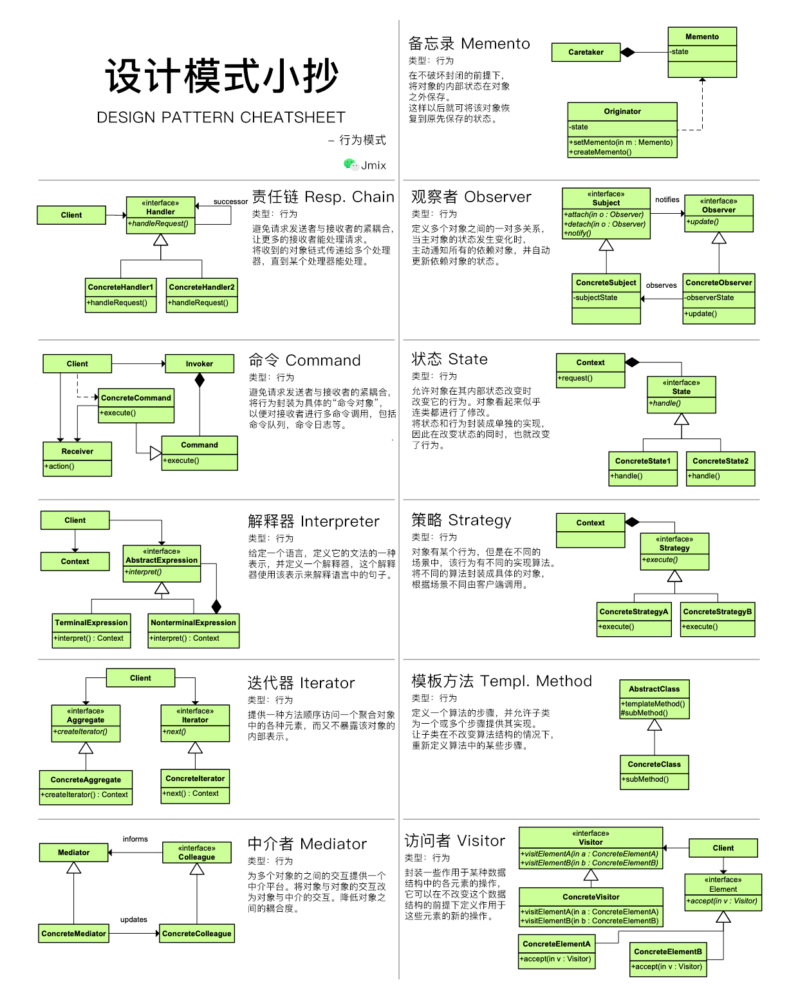

_高级软件开发工程师的必备技能：设计模式，这里一份我们总结的小抄送给大家_

<!-- more -->

 {.center .size-8 .radius .shadow}

<!-- # 大标题 -->

## 创建和结构模式

 {.center .size-10 .radius .shadow}

## 行为模式

 {.center .size-10 .radius .shadow}

## TODO

为模式添加示例代码。
