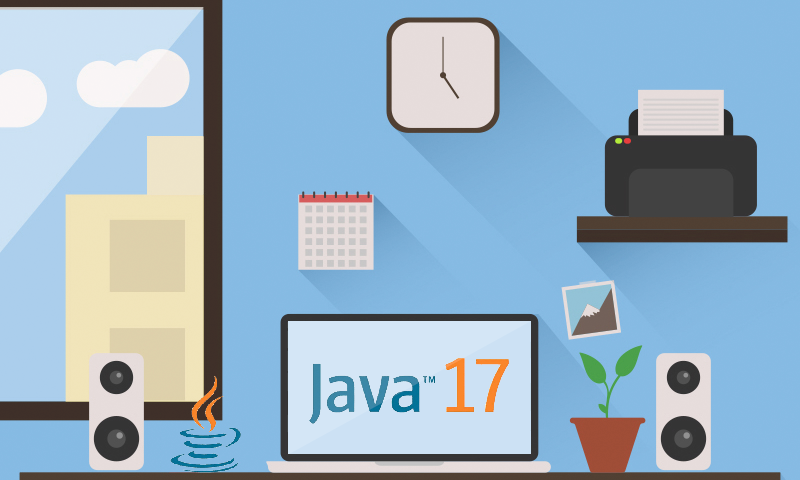
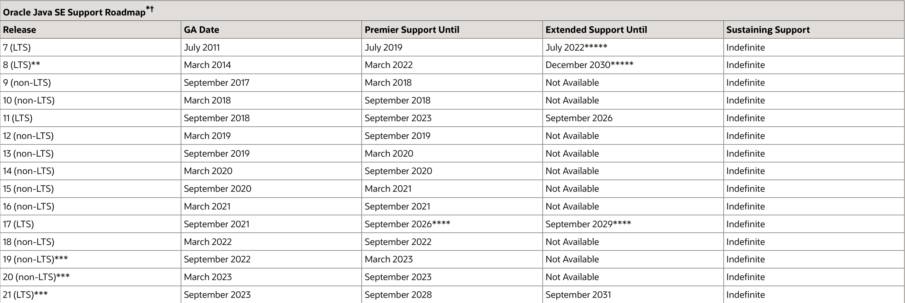
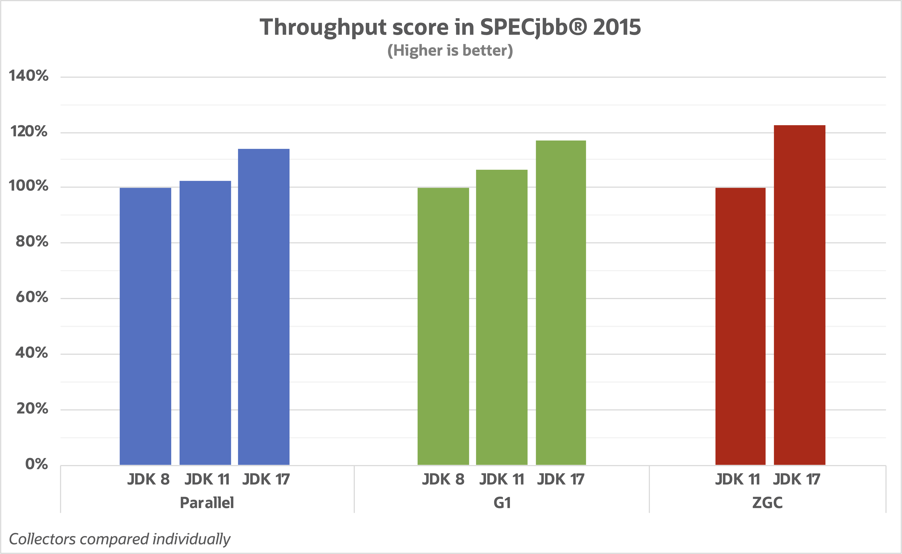
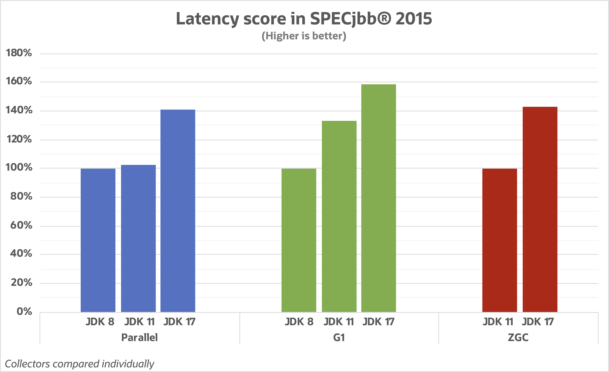
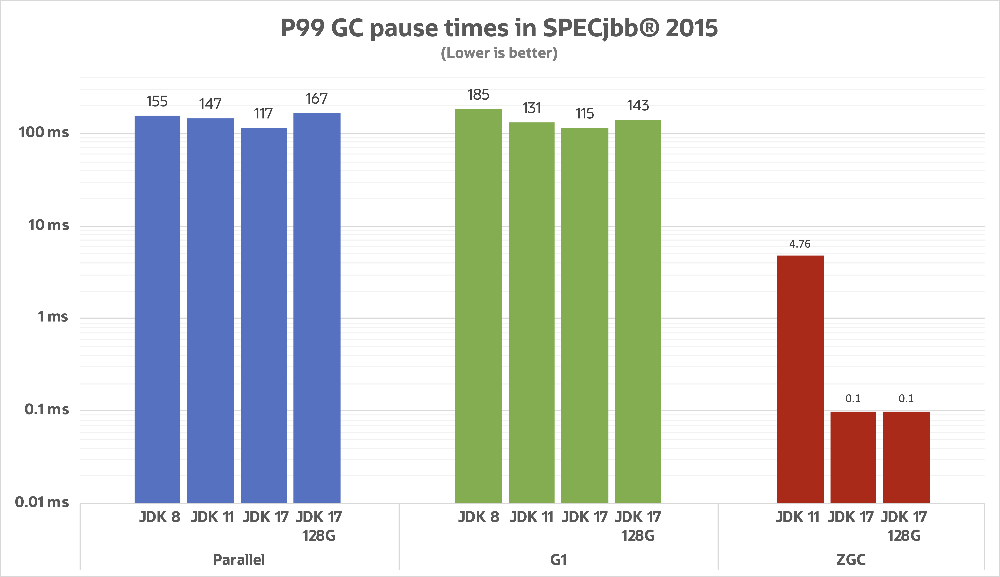
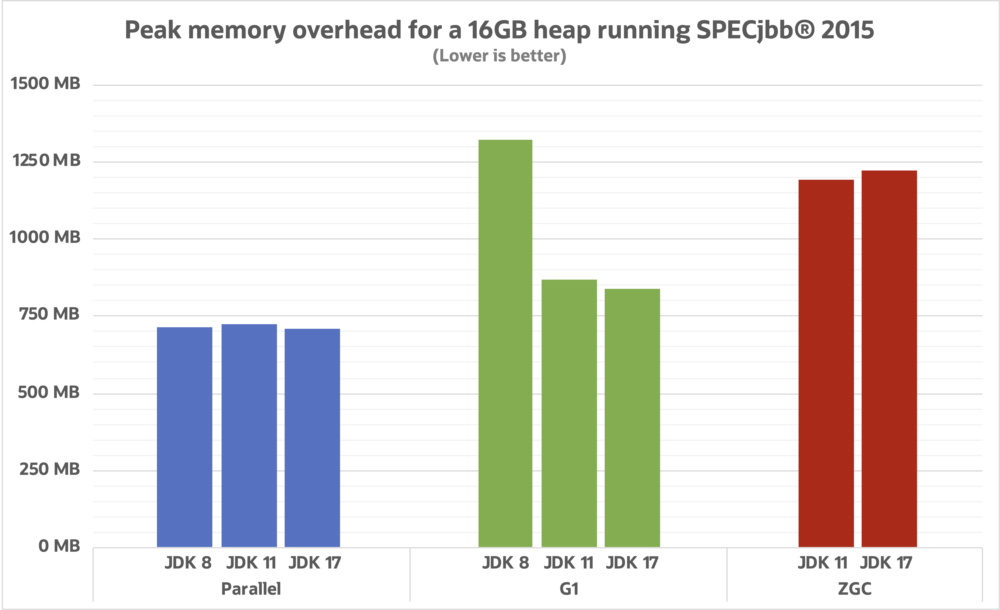

_还在用 JDK 8 吗？Spring 已经推荐使用 JDK 17 了，看看新的 JDK 都有什么提升吧。_

<!-- more -->


 {.center .size-8 .radius .shadow}

<!-- # 大标题 -->

Spring，作为 Java EE 的事实规范，在2022年11月16日发布了最新的 6.0.0 GA 版本。这个版本是框架后续新生代的初始版本，拥抱持续创新的 OpenJDK 和 Java 生态。新的版本以 Java 17+ 作为 baseline，并迁移至 Jakarta EE 9+（即，使用 `jakarta` 命名空间）。

而在基础设施方面，6.0 首次引入了 [AOT 转换](https://spring.io/blog/2022/03/22/initial-aot-support-in-spring-framework-6-0-0-m3)，并为 Spring 应用程序上下文提供了相应的 AOT 处理支持。这为 Spring Boot 3 的 GraalVM 原生镜像提供了支持。原生镜像的启动速度非常快，并且能减少 Java 应用程序占用的内存。此外，新版本中支持[虚拟线程](https://openjdk.org/jeps/425)，虚拟线程是轻量级的线程，能显著减少写入、维护的开销，在并发应用中有较高的吞吐量。

其中很重要的一点是，新的 Spring 6.0 只支持 Java 17+ 了，并且在 Spring 相关的博客中也建议大家升级 JDK 到 17。

## JDK LTS

下表是 [Oracle](https://www.oracle.com/java/technologies/java-se-support-roadmap.html) 官方提供的 JDK 支持计划：

 {.center .size-9 .shadow}

那为什么是 JDK 17 呢？首先，在 JDK 8 之后只有 JDK 11 和 17 是 LTS（长期维护）版本，而实际上 11 又被大家公认为是过渡版本，对于 JDK 17，Oracle 官宣会提供支持到 2029 年，这给了业界一个相当长的期许，终于可以考虑替换已经诞生 8 年且在2019年1月已经[停止公开更新](https://blogs.oracle.com/java/post/end-of-public-updates-is-a-process-not-an-event)的 JDK 8 了。

## 开发者关心的功能升级

下面我们看一下 JDK 从 8 升级到 17 的过程中，有哪些另开发者心动的功能呢？

### 接口私有方法（JDK9）

Java 8 支持在接口中编写默认（`default`）方法，而从 Java 9 开始，可以在接口中包含私有方法。私有接口方法不能是抽象的。私有方法只能在接口内部使用：

```java
public interface CustomCalculator {
    default int addEvenNumbers(int... nums) {
        return add(n -> n % 2 == 0, nums);
    }

    default int addOddNumbers(int... nums) {
        return add(n -> n % 2 != 0, nums);
    }

    private int add(IntPredicate predicate, int... nums) { 
        return IntStream.of(nums).filter(predicate).sum();
    }
}
```

### 本地变量类型推断（JDK10）

在 Java 10 之前版本中，当我们定义局部变量时，需要在赋值的左侧提供显式类型，并在赋值的右边提供实现类型：

```java
Person mike = new Person("Mike");
```

在 Java 10 以后，可以用下面的方式：

```java
var john = new Person("john");
var doe = new Person("Doe");

// JDK 9 中提供了集合类型的新方法
var persons = List.of(john,doe);

// var 也可用于 for
for (var person : persons) {
    System.out.println(person.name);
}
```

虽然我们写代码的时候方便了，但其实这是 JDK 提供的语法糖，在编译成 class 文件时，这些 var 还是会用实际的类型替换。

### HTTP Client（JDK11）

`java.net.http` 包中的 `HttpClient` 最初在 JDK 9 中提供，后来在 JDK 10 升级，在 JDK 11 终于稳定成为标准功能，同时支持 HTTP/1.1 和 HTTP/2。下面是用 `HttpClient` 发一个 `GET` 请求的例子：

```java
HttpClient httpClient = HttpClient.newBuilder()
        .version(HttpClient.Version.HTTP_1_1)
        .connectTimeout(Duration.ofSeconds(10))
        .build();

HttpRequest request = HttpRequest.newBuilder()
        .GET()
        .uri(URI.create("https://httpbin.org/get"))
        .setHeader("User-Agent", "Java 11 HttpClient Bot")
        .build();

HttpResponse<String> response =
    httpClient.send(request, HttpResponse.BodyHandlers.ofString());

HttpHeaders headers = response.headers();
headers.map().forEach((k, v) -> System.out.println(k + ":" + v));

System.out.println(response.statusCode());
System.out.println(response.body());
```

### Switch 表达式（JDK14）

Switch 表达式是指可以通过 `switch` 进行赋值，在 Java 12 和 13 中陆续提供了功能预览，而在 Java 14 中成为标准功能。看下面的示例：
```java
private static int getValueViaYield(String mode) {
    int result = switch (mode) {
        case "a", "b":
            yield 1; //使用 yield 提供返回值
        case "c":
            yield 2;
        case "d", "e", "f":
            // do something here...
            System.out.println("Supports multi line block!");
            yield 3;
        default:
            yield -1;
    };
    return result;
}
```

也可以通过箭头函数直接返回，但是这两种方式不能混用：

```java
private static int getValueViaArrow(String mode) {
    int result = switch (mode) {
        case "a", "b" -> 1;
        case "c" -> 2;
        case "d", "e", "f" -> {
            // do something here...
            System.out.println("Supports multi line block!");
            yield 3;
        }
        default -> -1;
    };
    return result;
}
```

### 文本块（JDK15）

文本块功能最开始在 Java 13 和 14 中提供预览，最终在 Java 15 成型，有了这个功能，定义 HTML、SQL 语句或者 JSON，都会更加方便：

```java
String java15DefineHtml = """
                            <html>
                                <body>
                                    <p>Welcome to my blog</p>
                                </body>
                            </html>
                          """;
String java15DefineJson = """
                            {
                               "name":"世开Coding",
                               "type":"blog",
                               "URL":"https://blog.abmcode.com"
                            }
                          """;
```

### instanceof 的模式匹配（JDK16）

在 JDK 16 以前，我们用 `instanceof` 是这样的：

```java
if (url instanceof String) {
    String s = (String) url;
    if (s.length() > 7) {
        if (s.equalsIgnoreCase("https://blog.abmcode.com")) {
            //...
        }
    }
}
```

那 JDK 16 之后呢，是这样的，是不是瞬间清爽了：

```java
// str 变量可以在后续逻辑中直接使用
if (url instanceof String str && str.length() > 5 && str.equalsIgnoreCase("https://blog.abmcode.com")){
    // ...
}
```

### Record（JDK16）

Java 被人诟病的一个原因是需要编写太多的模板代码，在新建一个 POJO 时，我们需要提供 getters，setters。Lombok 通过 IDE 工具简化了这个过程，而 Java 16 引入的 `Record` 类型也同样减少了这种类型的样板代码。需要注意的是，`Record` 都是 `final` 的，且成员变量也都是 `final` 的，但是可以支持实现接口，例如，`Runnable` 或 `Serializable`。因此，简单的方法参数封装或者 DTO 都是 Record 适应的场景。

```java
// 成员变量 name 和 url
public record WebsiteRecord(String name, String url) implements Serializable {
    public WebsiteRecord {
        if (!url.toLowerCase().startsWith("http")) {
            throw new IllegalArgumentException("Invalid URL address:" + url);
        }
        System.out.println("New Website:" + name);
    }
}
```

### Sealed Class（JDK17）

我们都知道，带有 `final` 修饰符的类是不能继承的，那如果有些情况，我们还是希望能扩展类的功能，但是限制只有某些类能继承呢？

在 Java 15 和 16 中引入了 Sealed Class 的功能预览，在 Java 17 中作为标准功能提供。Sealed Class 只允许特定的类继承。

```java
// 只允许 Bicycle, Car, Truck 继承
public abstract sealed class Vehicle permits Bicycle, Car, Truck {...}

// Car 带有 final 修饰符，防止进一步扩展
public final class Car extends Vehicle {...}

// Truck 带有 sealed 修饰符，只允许特定的类继承
public sealed class Truck extends Vehicle permits PickTruck, CyberTruck {...}

// Bicycle 带有 non-sealed 修饰符，任何类都可以继续扩展
public non-sealed class Bicycle extends Vehicle {...}

// 任意扩展 Bicycle 类
public class Motor extends Bicycle {...}
```

使用 Sealed Class 还有几点注意事项：
- 被许可的子类，必须在编译时能被父类访问到。
- 被许可的子类，必须直接继承 Sealed 父类。
- 被许可的子类，必须带有 `final`，`sealed`，`non-sealed` 三个修饰符之一。
- 被许可的子类必须在同一个 Java 模块中。

### 小结

JDK 版本的升级会引入新的编程语言功能，能进一步提高开发者编写程序的效率，以前需要好几行才能完成的功能，现在一行就搞定了。而新的概念和模块推出，也可以优化软件架构，减少对第三方库的依赖。

## 性能提升

JDK 17 不只是提供了开发者关心的一些编程语言功能，在与旧版本的 JDK 相比，性能也得到了很大的提升。与 JDk 8 和 JDK 11 这两个 LTS 相比，性能的提升主要得益于 JVM 中引入的新功能和改进，特别是 GC 方面的提升。

JDK 17 目前支持的垃圾收集器有：
1. Parallel GC - JDK 8 和早期 JDK 的默认收集器，关注**吞吐量**，尝试在最小延迟的情况下尽快完成工作并提高吞吐量。
2. Garbage First（G1）- JDK 9 开始使用的默认收集器，G1 关注**总体平衡的性能**，会尝试在吞吐量和延迟和吞吐量之间做平衡。
3. ZGC（JDK 15） 和 Shenandoah GC（JDK 12）- 这两个收集器关注**延迟**，通过牺牲吞吐量达到低延迟。
4. Serial GC - 关注**资源占用和启动时间**。这个收集器更像是一个简化版的 Parallel GC，仅使用单线程进行处理。

可以看到，不同的收集器关注的性能方面是不一样的，而决定使用哪个收集器，有时候也不是非常容易。首先我们需要搞清楚的是，我们的性能目标是什么？希望提高业务的吞吐量、减少业务的延迟还是减少资源的占用？当然，我们希望最好这几点能同时满足，但是 GC 是没有办法在每个方面都做到极致的，毕竟设计这些 GC 的时候，是目标场景做了一些权衡的。再看一下这三大需要提升的场景：

- 吞吐量 - 减少 GC 对完成单位时间内业务会话量的影响。
- 延迟 - 减少 GC 对单个业务会话的影响。
- 资源占用 - 减少 GC 使用的额外资源。

下面我们看看使用 16GB 堆内存和 [SPECjbb® 2015^1^](https://www.spec.org/jbb2015/) 基准测试对前三个收集器的测试结果。

### 吞吐量

 {.center .size-8 .shadow}

测试结果中，数值越高表示性能越好，可以看到，JDK 17 中，ZGC 的性能提升了 20%，Parallel GC 和 G1 也分别有超过 10% 的提升。

### 延迟

 {.center .size-8 .shadow}

从延迟的角度看，性能提升更加显著。在缩短 GC 暂停时间所投入的工作有了回报。其中 G1 提升效果最佳，ZGC 也不错。但是由于我们的基准测试是测量应用程序的延迟，所以还有数据在这个图表是看不到的。ZGC 在暂停时间上表现非常优异，下面的图表展示暂停时间的提升（数值越小越好），我们可以看到 ZGC 的超预期性能：

 {.center .size-8 .shadow}

在这里，我们分析原始性能数字（每个柱子上的数字），因为图表按照数据尺度做了归一化，看上去有点奇怪。正如我们所看到的，JDK 17 中的 ZGC 的表现远低于其亚毫秒暂停时间的目标。G1 的目标是在延迟和吞吐量之间保持平衡，其暂停时间目标也低于其默认暂停时间目标 200ms。此图表最右边的柱子展示不同的收集器如何处理可伸缩性。ZGC 的设计是暂停时间不随堆大小而增大，我们清楚地看到，当堆扩展到 128 GB 时就是这种情况。从暂停时间的角度来看，G1 比 Parallel 更好地处理较大的堆，因为 G1 也具有保持暂停时间目标的逻辑。

### 资源占用

 {.center .size-8 .shadow}

图中比较了三个不同收集器对本地内存的使用峰值。从结果看 Parallel 和 ZGC 都非常稳定，因此我们只能比较使用内存的绝对数值，而 G1 在这方面确实有所改进。

### 小结

无论使用哪种收集器，与旧版本相比，JDK 17 的整体性能都有很大的提升。在 JDK 8 中，默认使用 Parallel，但在 JDK 9 中改为了 G1。之后，G1 的改进速度就超过了 Parallel，但在有些情况下可能 Parallel 仍然是最好的选择。而 ZGC（JDK 15）的加入，为我们提供了第三种高性能 GC 的选择。

## 结语

开发环境方面，JDK 升级已经是大趋势，[Tomcat 10.1](https://tomcat.apache.org/whichversion.html) 已经支持 Jarkata EE，[Hibernate ORM 6.1](https://hibernate.org/orm/releases/6.1/) 也要求 JDK 11+。而最著名的开源框架 Spring 已经带头走在了更新 JDK 的康庄大道上，那么其他使用 Spring 的技术框架肯定会慢慢跟上。比如，[Jmix](https://jmix.cn) 也会在明年一季度的版本中适配 Spring 6 和 Boot 3；JHipster 更加激进，从 Spring RC 版本推出时，已经开始尝试适配。

运行环境方面，JDK 17+ 带来的性能提升总体来说能达到约 20%，但是对于实际运行的生产系统，这点提升可能不足以吸引运维部门做升级，毕竟堆硬件也能提升性能。而升级 JDK 还有可能引入新的安全问题。

因此，对开发人员来说，我们建议尽早切换至 JDK 17，尝试新的语言特性，提升自己的技能。尽管可能会面临新 JDK 中的安全问题，但是由于新版本正处在积极开发支持中，如果有问题也会很快解决。而对于企业来说，如果担心安全问题影响线上系统，可以缓一缓再使用。另外，如果考虑去 Oracle，则可以选择 OpenJDK，一些有实力的大企业也会使用 OpenJDK 构建自己的 JDK。

随着技术的发展，越来越多的框架的新版本都会陆续支持新版的 JDK，企业肯定会慢慢的融入升级的大军之中。

参考文章：
1. https://spring.io/blog/2022/11/16/spring-framework-6-0-goes-ga
2. https://reflectoring.io/java-release-notes/
3. https://kstefanj.github.io/2021/11/24/gc-progress-8-17.html
