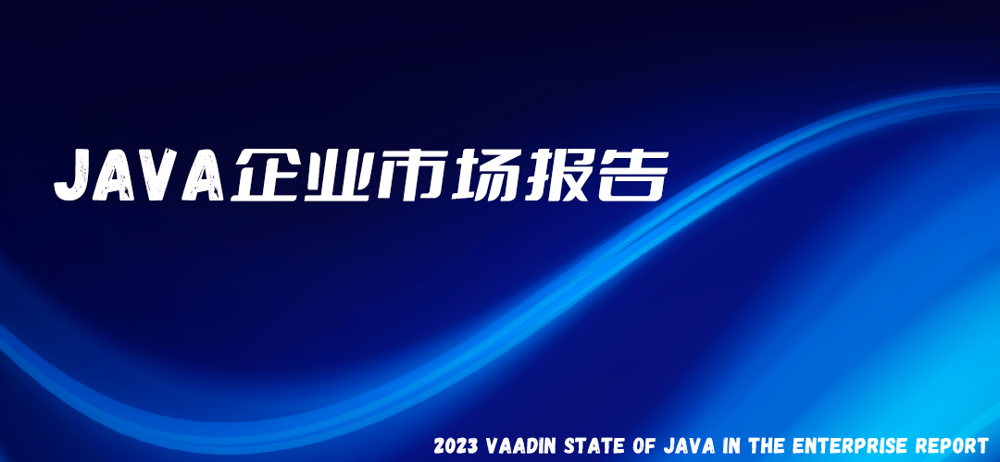
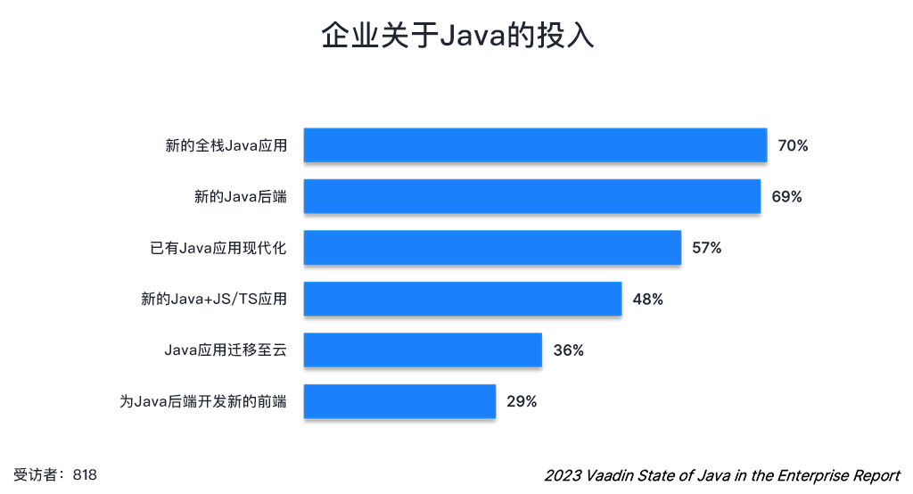
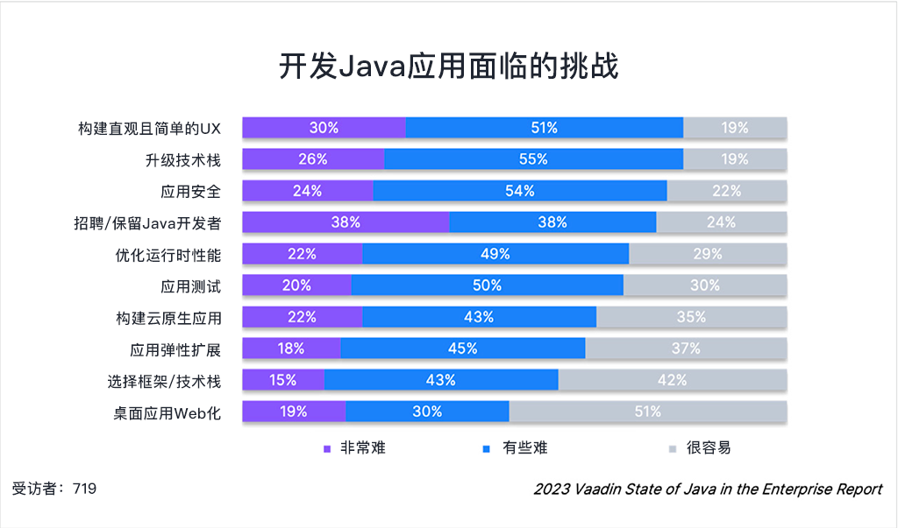
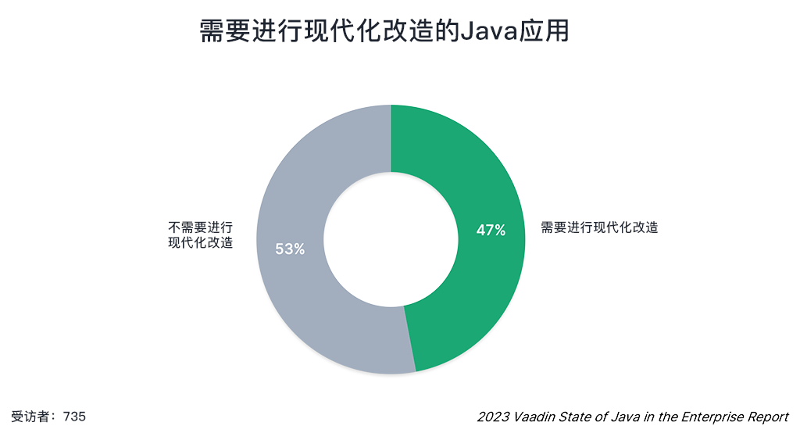
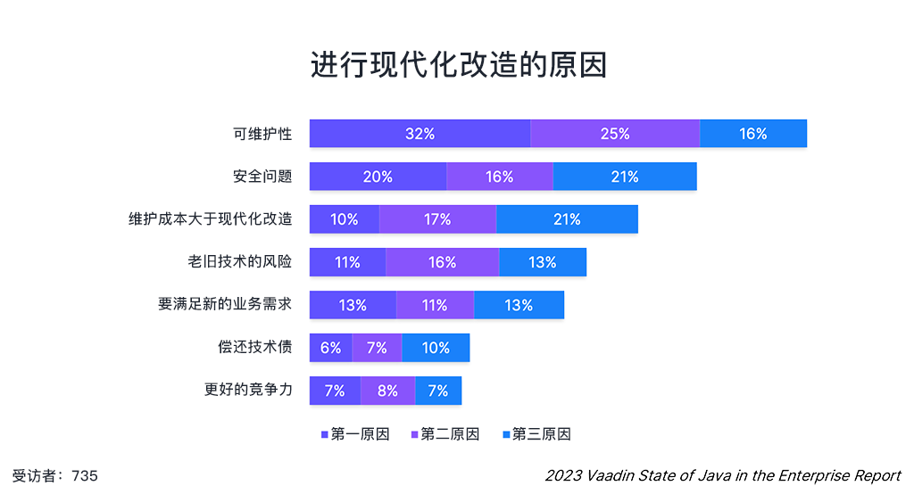
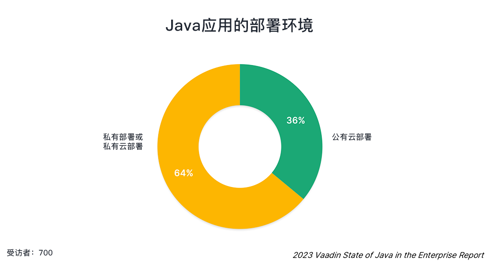
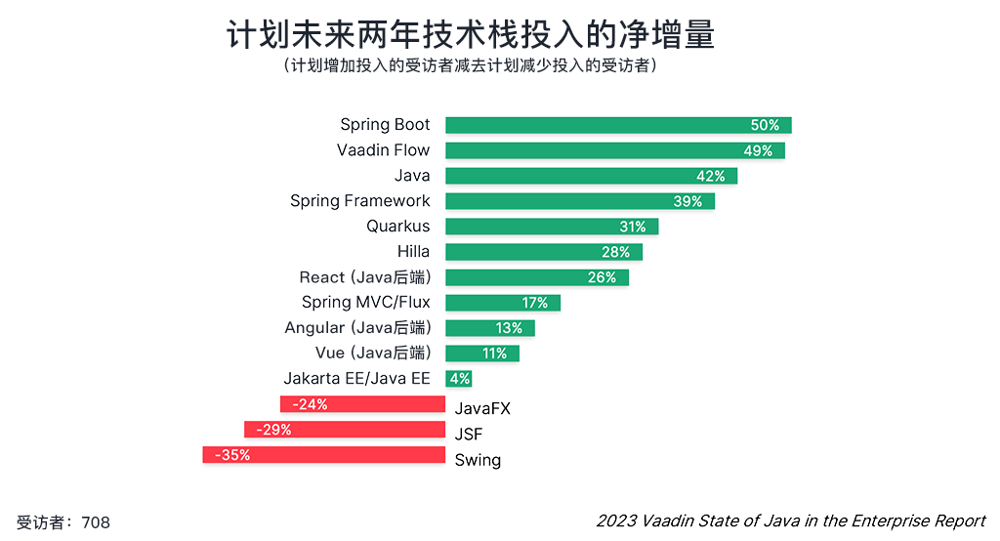
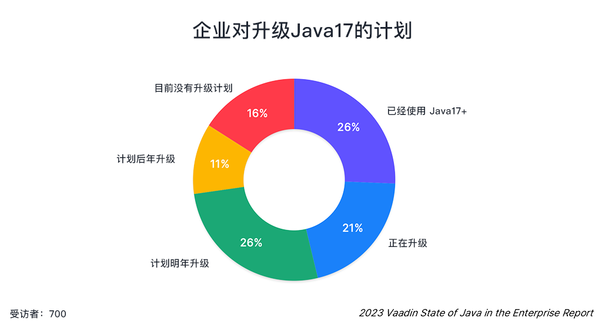

_Java已死？No No No，Java正在经历云原生复兴。_

<!-- more -->

  {.center .size-8 .radius .shadow}

<!-- # 大标题 -->

>前言：本报告由[Vaadin](https://vaadin.com/java-report-2023)提供。该报告中的调研活动于2022年11月至12月进行，共有879家IT公司参加了调研。参与者来自公共社交媒体渠道和Vaadin的数据库。这些受访者都是Java用户，其中只有46%的用户使用Vaadin。并非所有受访者都回答了每个问题，因此图表中提供了每个问题参与的受访者人数。

Java，首次发布于1996年，在2000年代初，互联网大爆炸使得Java获得了快速而广泛的使用。近年来，在Python、Go、Rust等新兴语言的冲击下，有一些“Java已死”的论调开始显现。然而直到今天，Java在几乎所有的开发人员调查中都仍然被评为三大编程语言之一，并且是企业应用的主力军。

这份报告中，我们也将看到，Java作为一种云原生技术正在经历变革性的复兴。企业仍在进行新的Java应用开发，同时也对现有的Java应用程序进行云原生的现代化改造。

## 发现1：Java仍然是企业应用的主力军

从818位受访者数据统计来看，企业仍然在Java方面有持续投入的趋势，包括新的全栈Java应用（70%）、新的Java后端应用（69%），以及现有Java应用的现代化改造（57%）。Java应用的现代化改造的主要目的是为了适应云原生，将已有的系统迁移至云端。

然而在企业级Java应用的开发中，受访者又面临着哪些困难呢？

从调研结果看，有81%的受访者表示开发直观且简单的UX是有难度的。其实这一点也不难理解，Java开发人员更多是后端或桌面应用开发，因此会不太适应构建基于Web的UI。

与UX旗鼓相当的另一个困难就是升级技术栈（同样为81%）这个困难可能源自Java庞大的生态以及数量众多的框架和库。排名第三的困难则是保证应用的安全性。

你认为Java应用开发中，最难的是哪部分呢？欢迎在评论区讨论！

如果你也面临UI构建困难、技术栈升级困难、应用安全等问题，不防了解一下[Jmix](https://www.jmix.cn)，基于Java最佳实践打造的Web快速开发平台，使用Java也能写UI，并且开箱具有企业级安全机制：

## 发现2：Java应用的现代化改造是重中之重

过去的一二十年中，各行各业都开发了大量的Java应用。在互联网高度发达的今天，许多历史遗留系统都需要进行现代化改造。受访者表示，在接下来的两年中，他们有计划增加对现代化改造的投入。

应用进行现代化改造的内容一般包括：技术栈升级、使用新的框架，以及进行云原生部署等。

那么，为什么要对已有的应用进行现代化改造呢？受访者按照优先级选出了自己认为进行现代化改造的动机和原因。

其中，有83%的受访者表示，应用程序的可维护性是促使他们进行现代化改造的三大原因之一。并且有近三分之一（32%）的受访者表示，可维护性是他们首要的动机和考量。应用程序的安全性和成本支出分列第二三名。

你有没有正在维护一个老系统？公司为什么不进行该系统的现代化改造呢？欢迎在评论区讨论！

## 发现3：Java应用正在往云原生迁移

Java应用发展的下一步就是将应用迁移至云原生的架构。从调研结果看，已经有超过三分之一的Java应用使用了公有云部署，并且越来越多的Java应用正在部署至公有云、容器、k8s，以及serverless环境。

在ToC领域，通过SaaS提供“部署一次，随处访问”的体验在互联网和移动设备高度发达的今天已经不是什么新鲜事了。

而在B端领域，随着类似ChatGPT这种基于SaaS提供AI服务的涌现，将离线的企业系统搬到云上并使用AI技术提供为企业提供垂直领域的高效应用也必然是下一趋势。

## 发现4：技术栈不断发展

Spring Boot将成为最大赢家，调研结果显示，有多达50%的净量受访者表示会加大对Spring Boot的使用。除此之外，Vaadin Flow，Spring Framework，Quarkus，Hilla和React等框架的采用率预计也将净增加。

一年多以前，Java的一个重大LTS版本17发布了。而Spring Boot的最新发布版Spring Boot 3也官宣将最低支持JDK17。从调研的结果看，目前已经有将近四分之三的企业已经升级到Java17或准备在未来一年中升级。

如果你还不确定要不要升级到Java17，请看我们的另一篇文章：

## 结论

Java作为企业级开发的主力军，不但用于内部系统，也用于对外的系统，对已有Java应用进行现代化改造是一个核心任务。尽管大多数Java应用都通过浏览器访问，但是构建直观且简单的UX是一个比较有挑战的任务。

企业计划通过对应用进行现代化改造以提高系统的可维护性和安全性，并且减少维护成本。越来越多的现代化Java应用开始部署在公有云，这种往云原生架构的迁移会在未来两年形成一个趋势，同时也对催生Java技术栈的迁移。

Vaadin的这份调研报告给了我们一些关于企业级Java应用的独特观点，Java正在经历变革式的复兴，老旧Java系统也在通过现代化改造适应云原生世界。Java仍将是企业级应用开发中的核心角色，那些“Java已死”的论调可休矣！

